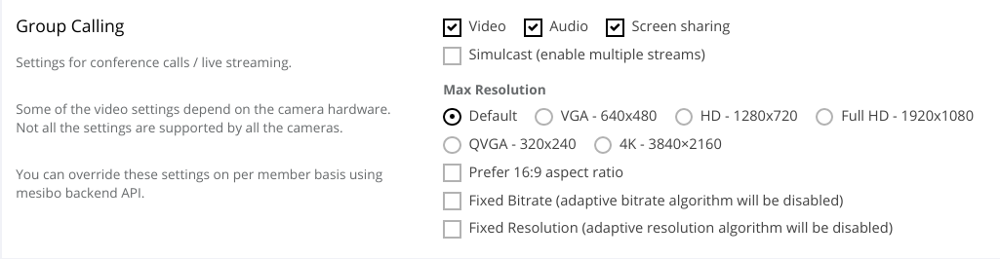
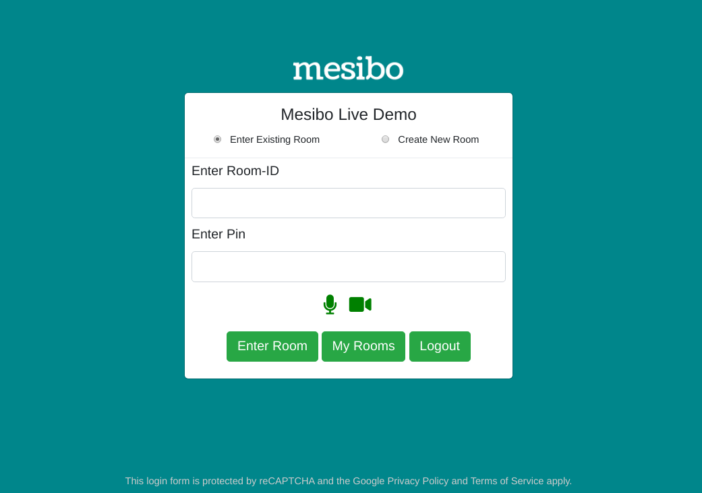
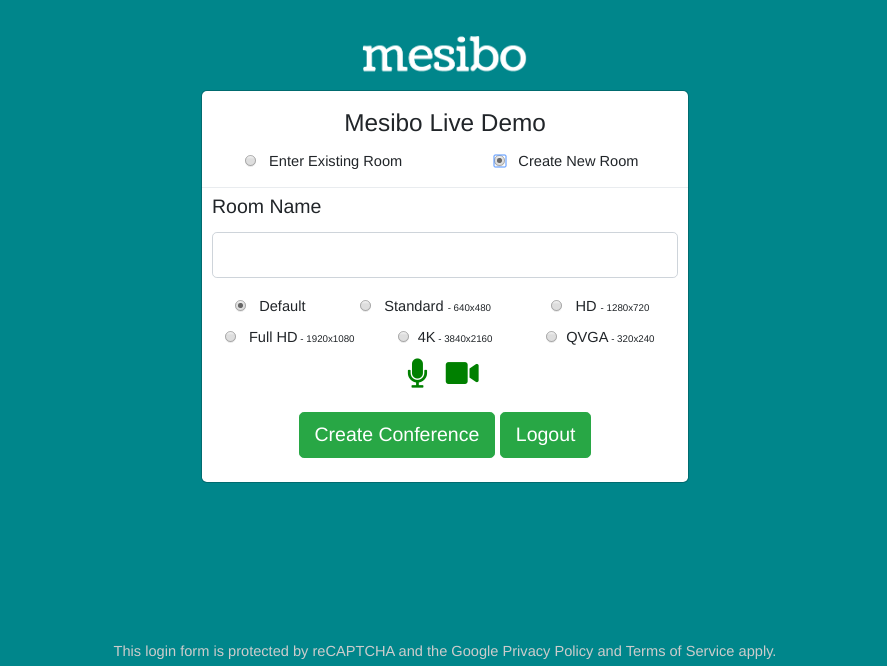

Mesibo Conferencing and Streaming Platform helps you build applications at scale for teleconferencing, virtual events, webinars, on-demand streaming, and more. The platform is available both on the cloud and on-premise at no additional cost.

Mesibo offers a powerful combination of features to build any kind of conferencing and streaming application with minimal setup and cost.

- Just under a 700KB memory footprint makes mesibo the lightest conferencing server in the world. You can run mesibo's conferencing platform on any server with minimum resources, even on something like a Raspberry Pi
- Load balancing architecture lets you add as many servers as your needs grow. Both for capacity and geographical proximity.
- Supported codecs include VP8, VP9, H.264, H.265, Opus, Opus multichannel for high-quality streaming
- Standard, HD, Full-HD, and 4K conference rooms - you can select resolution depending on bandwidth and CPU usage per participant.
- Fine control over all video & audio parameters and user permissions
- Simultaneous Camera and Screen Sharing
- Simultaneous Publishing to multiple groups, this unique mesibo capability enabled you to make interesting use cases for live-streaming.
- Run the entire platform on your own premise at no additional cost.
- Open source zoom like app build on mesibo API with conference call, group messaging, etc.

# Mesibo Conferencing and Streaming
Mesibo conferencing and streaming can be readily integrated with your existing applications which are using Mesibo messaging and call APIs. In just a few steps, you can set up any type of streaming and conferencing application you need- virtual meeting and conferencing, live events, webinar, etc.

With Mesibo, you don't need to learn anything new. Mesibo made group calling simple by extending existing [group APIs]https://mesibo.com/documentation/api/backend-api/#group-management-apis) for the call as well. With additional permissions enable you to control who can publish and view, you can build any kind of application to suit your needs.

For example, say you want to build a conference room to host a virtual meeting - you create a group and allow everyone to publish their video and subscribe to other publishers.  On the other hand, if you are creating a panel discussion room, you give panel permission to only the panel members and only the viewing permissions to the rest.

If you now open the mesibo console(https://mesibo.com/console), you will now see a new section in group settings like below. All the configuration can be done using mesibo API as well.



As you can see, you can set the type of stream you need, such as audio or video or both. For example, you can have a video or audio only group call. If you need to show a presentation or some charts, you can enable screen sharing. You can set the max resolution depending on your participants' bandwidth and CPU usage.  Mesibo lets you create an even 4K resolution room at no extra cost. However, if your participants are on a low bandwidth network, mesibo will adjust the streams for them unless you decide to disable bandwidth control.

> Note that although you can enable the resolution required here in the console, your camera/device must support recording that resolution. It is recommended that you enable the resolution that best meets your bandwidth and device capacity.

That's it. You are now good to go! You can now use Mesibo's group calling APIs and build a conferencing app.


That's it. You are now good to go! You can now use Mesibo's group calling APIs and build a conferencing app.

This sounds good enough for a basic conference call. But, a one size fits all approach will not work for all your needs. For example, you may need a conference room where only the department heads are allowed to be publishing their stream, while all others are by default muted.There can also be admins or moderators who have special permissions to change group settings, remove participants, mute members, etc. How can you build something like this?  

You can achieve this with a fine control on who can connect and publish to your room, what kind of streams they can send or receive. In fact with Mesibo's custom group settings and permissions you can create any kind of streaming and conferencing app you require. 

Mesibo offers you these settings at two levels: 
1. Group Level: You can apply these settings at the group level, which will apply to all the members of the group
2. Member Level: You can modify settings at the individual member level

In case of group messaging you have the same type of controls. With group calling you just have an additional set of settings along with these permissons. Mesibo Group Calling APIs simply extend the features offered in group messaging.

### Group Calling - That's just Group messaging with extra steps!
In your console, along with the settings for a normal group we will now see new settings for group calling. Mesibo APIs for conferencing, extend the core features offered by mesibo [Group Management and Messaging APIs](https://mesibo.com/documentation/api/backend-api/#group-management-apis). 

If you are not familiar with using [Mesibo Group Management APIs](https://mesibo.com/documentation/api/backend-api/#group-management-apis), here's a little recap. Feel free to skip ahead if you are already familiar with group messaging.

## Group Messaging
Mesibo allows you to create groups having a set of users as group members. Once you create a group, you can send messages to the group, and all the group members will receive the messages. To set up a group with Mesibo APIs you follow the steps below:

1. Create a group.
2. Add Members.
3. Grant Permissions about who can send and received messages. For example you can set permissions such that only members can send, only selected members can send, only Selected Members can receive, etc. You can also grant admin rights to who can change group settings, who can remove members, etc

In group messaging, when you send a message to the common group every member gets a message notification. The user opens the message and reads it. In the same way, in group calling, when you make a call to the group, every member of the group get's a call notification and each member of the group will connect with the call. 

You can restrict which member can send a message,who can only recieve message, etc. By specifying member behaviour and permissions you can build [groups of different types](https://mesibo.com/documentation/api/backend-api/#group-management-apis). 


In case of group messaging, each member has the following permissions:
- can send :  If member can send messages to the group
- can receive: If member can receive messages from the group

Now, for group calling, in addition to above, each member has the following permissions:
- can publish :  If member can make (publish) group voice or video calls
- can subscribe: If member can subscribe to group voice or video calls 
- can list: If member can get a list of active callers in the group

This offers you a very fine level of control that allows you to have to ensure higher levels of privacy and security. It also helps you build exactly what you need your application to be, with maximum customizability. If you can think it, you can build it. Any type of conferencing and streaming app that you need can be easily configured.

### Conference
In a conference room you need the members of the group to publish their own stream and see other's streams. Every member will get a list of participants who are publishing their streams. They can then view the streams of each participant. So, you have the following permissions set.


### Webinar
In a webinar you only need one(or a few more) members to be publishing. The other participants will only be listening or viewing the streams. Other members will not be allowed to publish their own streams. This can be achieved with the following permission levels.


This is for an open webinar. So, what would you do in case of a members only webinar? You can change the permission as follows
Who can view live streams: Members , Who can view streams list: Members 

### Class Room
If you have an online classroom, the teacher has the controls to change the permissions of the students. At the group level, you can set that only selected members can publish- The teachers.


The students by default do not have the permission to publish. By default you can mute all the students. The teacher can dynamically set which student can talk when any clarification is needed. You can have this dynamic control, by individual member level permissions.


You can similarly build the set of required permissions for any scenario.In case of a video streaming app, You can upload media to the group, which only selected members can view on-demand, whenever they need it. All of this can be built by setting the different group calling permissions.

Let's now take a look at the different API functions that you can use to set up your conferencing and streaming platorm.
A detailed documentaion of each function/method can be found [here]() and will be explained with examples in the next section to build a zoom like conferencing app. 

### Create a group
Use Mesibo's Group Management APIs to create a group. Add members and set permissions for the group members.

### Get list of members
When any member joins the group, they will be getting a list of other members in the group. The callback function `Mesibo_onParticipant` will be called.

### Place a call to group
To place a call to the group, first you need initialize the group call. For this you need to use `initGroupCall()` which will provide you with a group call object and then link it with a group using `setRoom`. 

### Connect to voice and video of members
Once you get a list of participants, you can choose to connect to each of those streams. To connect to a participant's stream you need to use the `call` method. 

# Mesibo Live Demo App

In this section we will build Mesibo Live- a video conferencing app like Zoom. Before you proceed, please make sure that you have read the prerequisites and are familiar with mesibo APIs. First we will build a simple, basic version of the group calling app using basic HTML/CSS and Javascript . Then we will build the complete app with all the necessary features.

You can download the source code for the basic group calling demo [here](https://github.com/mesibo) to understand the basic functionality of conferencing and steaming APIs

Checkout [Mesibo Live Demo](https://mesibo.com/livedemo) which is a fully functional, Zoom Like Video Conferencing app. You can also download the entire source code from [github](https://github.com/mesibo). 

### Prerequisites

- This demo use Mesibo Javascript SDK. So, install Mesibo Javscript SDK by following the instructions [here](https://mesibo.com/documentation/install/javascript/)
- Familiar with Mesibo [User and Group Management APIs](https://mesibo.com/documentation/api/backend-api/#group-management-apis)
- Familiar with the basic concepts of how Mesibo APIs for streaming and conferencing work
- A basic understanding of HTML/CSS/JS
- A minimal understanding of Bootstrap

### Core features needed for group calling

For our group calling app, we need the following core features.
1. A conference room which people can join
2. A list of participants and a way to update the list of participants as and when people join or leave the room
3. Stream my own video, to the group.
4. View the videos of participants in the group

For starters, let us layout a basic UI in HTML and then understand how the Javascript API works.

### UI Elements needed for group calling
Based on the features we discused before, we need to have a few UI elements to display the local video stream, the remote video streams, buttons for muting audio/video streams,  a button to share our screen with the group and exit the group or hangup.

For now, we will just have one local video stream and one remote video stream in `room.html`

```HTML

<div class="row">
	<!-- Publish your own stream-->
	<div class="col-md-4">
		<div class="panel panel-default">
			<div class="panel-heading">
				<h3 class="panel-title" id="publisher">Your Stream</span>
				</h3>
			</div>
			<div class="panel-body" id="videolocal" style="background-color: grey">
				<video class="rounded centered" id="video-publisher" width= "320px" height="240px" autoplay playsinline muted="muted" /></video>
				<div class="btn-group" role="group" aria-label="video controls" >
					<button type="button" class="btn btn-secondary" style="font-size: 15px" onclick="publish()">Publish</button>
					<button type="button" class="btn btn-secondary" style="font-size: 15px" onclick="muteSelfVideo()">Mute Video</button>
					<button type="button" class="btn btn-secondary" style="font-size: 15px" onclick="muteSelfAudio()">Mute Audio</button>
					<button type="button" class="btn btn-secondary" style="font-size: 15px" >Hangup</button>
				</div>
			</div>
		</div>
	</div>

	<!-- Load remote streams dynamically -->
	<div class="col-md-8">
		<div class="row">
			<div class="col-md-4 letter-box">
				<div class="panel panel-default">
					<div class="panel-heading">
						<h4 class="panel-title" id="video-stream-name">Remote Stream</span>
						</h4>
					</div>
					<div class="panel-body">
						<div style="background-color: grey; width: 320px; height: 240px">
							<video class="rounded centered" id="video-remote" autoplay playsinline muted="muted"/>			  </div>
					</div>
					<div class="btn-group" role="group" aria-label="video controls" >
						<button type="button" class="btn btn-secondary" style="font-size: 15px" onclick="subscribe()">Subscribe</button>
						<button type="button" class="btn btn-secondary" style="font-size: 15px" onclick="muteRemoteVideo()">Mute Remote Video</button>
						<button type="button" class="btn btn-secondary" style="font-size: 15px" onclick="muteRemoteAudio()">Mute Remote Audio</button>
						<button type="button" class="btn btn-secondary" style="font-size: 15px" >Hangup</button>
					</div>

				</div>
			</div>
		</div>
	</div>
</div>

```

## 1. Creating a Conference Room

The conference room is a group. Only the members of a group, will be able to view the streams of other members of the same group. 

### Creating a User
Before creating a group, we need to create a mesibo user for the admin. Note that anyone who wants to join the group, also need to be a mesibo user with a token. 

Refer [First Tutorial](https://mesibo.com/documentation/tutorials/first-app/) to know how to create a user. Set the token as `MESIBO_ACCESS_TOKEN` in `demo.js`.

### Creating a Group
For a conference room we need to create a group that other people can join. The creator of the room, will configure all the room properties.

Refer to [Creating a Group](https://mesibo.com/documentation/api/backend-api/#create-a-group). Set `DEMO_GROUP_ID` and `DEMO_GROUP_NAME` in `demo.js`.

## 2. Getting a list of Participants

Other members, are also mesibo users who are part of the same group(conference room) as you(the publisher). Other group members are also publishing their own streams.

Before we get the list of participants, first we need to initialize mesibo and connect to a group.

### Initialize Mesibo
To initialize Mesibo, create an instance of Mesibo API class `Mesibo`. Set the app id and token that you obtained while creating the user.
 
You can initialize and run mesibo as follows:
 
```javascript

    var mesibo = new Mesibo();
    mesibo.setAppName(MESIBO_APP_ID);
    mesibo.setCredentials(MESIBO_ACCESS_TOKEN))
    var listener = new MesiboNotify(mesibo);
    mesibo.setListener(listener);
    mesibo.setDatabase("mesibo");
    mesibo.start();

```
### Initialize Group Calling & Streaming

To set up group calling and streaming call `initGroupCall()` to create the group call object. 
To link the room with a group, call the `setRoom` method of the group call object, by passing the group-id.

An example in Javascript is as follows,
```javascript
    
    //Create group call object
    var live = mesibo.initGroupCall(); 
    
    live.setRoom(DEMO_GROUP_ID);     
```

Now you will get a list of group members through the listener `Mesibo_onParticipants`. You can choose and subscribe to the stream of each member to view it. When a new participant joins the room, `Mesibo_onParticipants` will be called. 

```javascript

MesiboNotify.prototype.Mesibo_OnParticipants = function(all, latest) {
	for(var i in latest) {
		var p = latest[i];
		subscribe(p);			
	}
}

```
The parameter `all` contains an array of all participants who have joined.
The parameter `latest` contains the array of participants that have just joined the group.

You can now iterate through the list of participants and subscribe to the stream of each participant.

### 3. View the streams of participants in the group
You can subscribe to the stream of each participant  that you get in `Mesibo_onParticipants` as follows with the `call()` method
The `call` method takes the following parameters:
- The ID of the HTML element where the video will be rendered
- A callback function `on_stream` where you will be notified of the stream
- A callback function `on_status` where you will be notified when the mute status changes, there is a change in quality of the stream,if the participant has hung up, etc

For example, if the ID of the HTML element where the video will be displayed is `video-stream` then, we can connect to the call as follows:
```javascript
function subscribe(p){
	p.call(null, 'video-stream', on_stream, on_status);
}

function on_status(p, status, video){
	if(MESIBO_CALLSTATUS_CHANNELUP == status){
		console.log(p.getName()+ 'is connected');
	}
	
	if(MESIBO_CALLSTATUS_COMPLETE == status){
		console.log(p.getName()+ 'has disconnected');
	}
}

function on_stream(p){
	p.attach('video-stream');
}
```

### Publishing your self stream
Call the `getLocalParticipant` method to initialize local publisher(the stream you need to send) 
```javascript

// Create a local participant, Set Publisher name and address
var publisher = live.getLocalParticipant(USER_NAME, USER_ADDRESS); 
publish(publisher);
```    
You are the publisher. As a member of the conference room group you can stream your own self, which other members can view.
If the ID of the HTML Element is `video-publisher` then we publish as follows:

```javascript
function publish() {
        console.log('publish');
        var o = {};
        o.name = 'local publisher';
        o.groupid = DEMO_GROUP_ID;
        //Can be camera source indicated by stream quality. Ex: '720p'. Or 'screen' for sharing screen
        o.source = publisher_source;
        publisher.call(o, "video-publisher", on_stream, on_status);
}


```
The available quality options for the source are `180p`,`240p`,`360p`,`480p`,`720p`,`1080p`,`2160p`

### Muting Streams
We can mute video and audio locally, for the streams that we are view. For this there are methods available in the stream object. 

```javascript
Stream.toggleMute(video)
```
Parameters:
- `video` Boolean , `true` for video, `false` for audio

For example, to mute audio and video of your own stream-- the publisher
```javascript
function muteSelfVideo() {
        publisher.toggleMute(true, false);
}

function muteSelfAudio() {
        publisher.toggleMute(false, false);
}

```

### Getting the Mute Status of a stream

You can get mute status of a stream with `muteStatus` which has the syntax below:
```javascript
Stream.muteStatus(video,remote)
```
Parameters:
- `video` Boolean , `true` for video, `false` for audio
- `remote` Boolean, `true` for remote source, `false` for local source

Example,
```javascript
	remote.muteStatus(true, false); // video mute status-local source
	remote.muteStatus(false, false); // audio mute status-local source
	
	remote.muteStatus(true, true); // video mute status-remote source
	remote.muteStatus(false, true); // audio mute status-remote source
```
# Building a Zoom Like Conferencing app 

Video conferencing apps like Zoom and Google Meet are showing new ways for people to virtually collaborate and connect. Streaming services like Netflix, Youtube, Prime Video, etc have forever changed the way people consume entertainment and media.

Let us now build a Zoom like Conferencing app using Mesibo Conferencing and Streaming APIs.

You can try the [Mesibo Live Demo(Beta)](https://mesibo.com/livedemo) which is a fully functional, Zoom Like Video Conferencing app and also download the entire source code from [Github](https://github.com/mesibo/conferencing). 


### Prerequisites

- We will be using the Mesibo Javascript SDK. So, install Mesibo Javscript SDK by following the instructions [here](https://mesibo.com/documentation/install/javascript/)
- Familiar with Mesibo [User and Group Management APIs](https://mesibo.com/documentation/api/backend-api/#group-management-apis)
- Familiar with the basic concepts of how Mesibo APIs for streaming and conferencing work
- A basic understanding of HTML/CSS/JS
- A minimal understanding of Bootstrap
- Not an absolute need, but a familiarity with Angular would be good to have

Let's get started!

### Basic Requirements

We need the following features.
1. A conference room which people can join
2. A list of participants and a way to update the list of participants as and when people join or leave the room
3. View the videos of participants in the group
4. Send my own video, to the group.
5. Mute audio/video of other participants and my own

## 1. Creating a Conference Room

The conference room is a group. We will use REST APIs to perform the operations to create a group and join a group on Mesibo backend. Only the members of a group, will be able to view the streams of other members of the same group.

### Creating a User
Before creating a group, we need to create a mesibo user for the admin. We will be using the token that we receive in this step - the access token of the admin user, while creating the group in the next step. Note that anyone who wants to join the group, also need to be a mesibo user with a token. 

So, for the first step we need to create a login form, where we authenticate them and generate a token for them.



1. We will ask for the name and email of the user and send an OTP to their email. To do this send a request with the following parameters to send an OTP to the email of the user.
```
https://app.mesibo.com/conf/api.php?op=login&appid=APP_ID&name=NAME&email=USER_EMAIL
```
2. The user will now need to enter the OTP receieved which we then send to backend for verification with the following request
```
https://app.mesibo.com/conf/api.php?op=login&appid=APP_ID&name=NAME&email=USER_EMAIL&code=OTP_RECEIVED
```
If the entered OTP matches, we generate a token for that user, you will receive a token in the response. Save the token. You can refer to the `getMesiboDemoAppToken()` function in `login.js`.


### Creating a Room
For a conference room we need to create a group that other people can join. The creator of the room, will configure all the room properties.

For better safety and privacy, we can also set a pin or password to our group. When anyone needs to enter the group they need to enter this pin. This is optional. If you do not need this, do not use the pin parmeter while sending the request.

For simplicity, we will only set the room name and pin for now. We will be creating a normal group where all members can send and receive streams.



You can choose between two room types: Webinar and conference. In case of webinar, participants should not be allowed to publish by default.
```javascript
const GROUP_TYPE_CONFERENCE = 0;
const GROUP_TYPE_WEBINAR = 1;
```

We can also set the video quality settings required.
```javascript
const STREAM_RESOLUTION_DEFAULT = 0 ;
const STREAM_RESOLUTION_QVGA  = 1 ;
const STREAM_RESOLUTION_VGA = 2 ; 
const STREAM_RESOLUTION_HD = 3 ;
const STREAM_RESOLUTION_FHD = 4;
```

If you are hosting [Mesibo Backend](https://github.com/mesibo/messenger-app-backend), modify the REST Endpoint accordingly.
Here, we will use `https://app.mesibo.com/conf/api.php`.

You can create a group, by making a request in the following format:
```
https://app.mesibo.com/conf/api.php?token=USER_ACCESS_TOKEN&op=setgroup&name=ROOM_NAME&pin=ROOM_PIN&type=ROOM_TYPE&resolution=ROOM_RESOLUTION
```
## 2. Getting a list of Participants

Other members, are also mesibo users who are part of the same group(conference room) as you(the publisher). Other group members are also publishing their own streams.

Before we get the list of participants, first we need to initialize mesibo and connect to a group.

### Initialize Mesibo
To initialize Mesibo, create an instance of Mesibo API class `Mesibo`. Set the app id and token that you obtained while creating theuser.
Call the `getLocalParticipant` method to initialize local publisher(the stream you need to send) 
You are the publisher. As a member of the conference room group you can stream your own self, which other members can view.

You can initialize and run mesibo as follows:
 
```javascript

	$scope.initMesibo = function(){
		$scope.mesibo = new Mesibo();

		//Initialize Mesibo

		MesiboLog(MESIBO_APP_ID, $scope.user.token, 'initMesibo');
		$scope.mesibo.setAppName(MESIBO_APP_ID);
		if( false == $scope.mesibo.setCredentials($scope.user.token))
			return -1;

		$scope.mesibo.setListener($scope);
		$scope.mesibo.setDatabase("mesibo");
		$scope.mesibo.start();

		$scope.live = $scope.mesibo.initGroupCall();        
		$scope.live.setRoom($scope.room.gid);
		$scope.publisher = $scope.live.getLocalParticipant($scope.user.name, $scope.user.address);
		if(!isValid($scope.publisher))
			return -1;        


		MesiboLog('publisher', $scope.publisher);

		$scope.call = new MesiboCall($scope);
		$scope.file = new MesiboFile($scope);

		$scope.refresh();

		return 0;
	}


```
### List of Participants

Now you will get a list of group members through the callback function `Mesibo_onParticipants`. You can choose and subscribe to the stream of each member to view it. When a new participant joins the room, `Mesibo_onParticipants` will be called. 

```javascript
	$scope.Mesibo_OnParticipants = function(all, latest) {

		MesiboLog('Mesibo_OnParticipants', all, latest);
		for(var i in latest) {
			var p = latest[i];
			if(isValid(p.getAddress) && isValid(p.getName()))
				$scope.addressBook[p.getAddress()] = p.getName();
			$scope.subscribe(p);			
			playSound('assets/audio/join');
			$scope.addTicker(p.getName() + ' has entered the room');
		}
	}


```

You can now iterate through the list of participants and subscribe to the stream of each participant.

### 3. Subcribe to the streams of participants in the group
You can subscribe to the stream of each participant  that you get in `Mesibo_onParticipants` as follows with the `call()` method. We need to update two lists `$scope.participants` & `$scope.streams`. 

```javascript
	$scope.subscribe = function(p) {
		MesiboLog('subscribe', p);

		p.isVisible = true;
		p.isSelected = false;
		p.isFullScreen = false;
		p.isConnected = true;

		$scope.updateParticipants(p);
		$scope.updateStreams(p);	
	}
	
	$scope.updateParticipants = function(p){
		MesiboLog('updateParticipants', p, $scope.participants, $scope.streams);
		if(!isValid(p))
			return;

		for(var i = 0; i < $scope.participants.length; i++){ 
			if ( $scope.participants[i].getId() === p.getId()) { 
				MesiboLog('updateParticipants','existing');
				$scope.participants[i] = p;
				return;
			}
		}

		$scope.participants.push(p);
	}

	$scope.updateStreams = function(p){
		MesiboLog('updateStreams', p, $scope.participants, $scope.streams);
		if(!isValid(p))
			return;

		for(var i = 0; i < $scope.streams.length; i++){ 
			if ( $scope.streams[i].getId() === p.getId()) { 
				MesiboLog('updateStreams','existing');
				$scope.streams[i] = p;
				return;
			}
		}

		$scope.streams.push(p);		

		$scope.setGrid($scope.streams.length);

		$scope.$applyAsync(function()  {
			MesiboLog('call stream', p);
			p.call(null, "video-"+ p.getId(), $scope.on_stream, $scope.on_status);
		});

	}	
```

### 4. Displaying the grid of videos

We need to dynamically render the grid of videos from the list of streams. That is, if there is only a single video we need to display the video upto the full width of the screen. But, if there are four streams , we need to split the available screen into four equal parts. If there are more, our grid will be divided into more pieces. (As of now we will have a maximum of 16 streams to be displayed at a single time on the screeen)

To build this feature we will use Bootstrap [Column Wrapping](https://getbootstrap.com/docs/4.0/layout/grid/#column-wrapping).

Based on the `grid_mode` we will define the number of columns our grid will have. Based on the number of streams, we will define the grid mode.

```javascript

	$scope.setGrid = function(stream_count){
		MesiboLog('==> setGrid', 'stream_count', stream_count, 'grid_mode', $scope.grid_mode);
		var isGridChange = false;
		var previous_grid_mode = $scope.grid_mode;

		if(!isValid(stream_count) || stream_count <= 0){
			$scope.grid_mode = DEFAULT_GRID_MODE;
			return isGridChange;
		}
		

		if(1 == stream_count)
			$scope.grid_mode = 1;
		else if(stream_count >=2 && stream_count <=4 )
			$scope.grid_mode = 2;
		else if(stream_count >=5 && stream_count <=9 )
			$scope.grid_mode = 3;
		else if(stream_count >=10 && stream_count <=16 )
			$scope.grid_mode = 4;
		else
			$scope.grid_mode = 4; /** Maximum 16 thumbnails can be displayed for now **/

		MesiboLog('==> setGrid', 'stream_count', stream_count, 'grid_mode', $scope.grid_mode);

		if(previous_grid_mode != $scope.isGridChange)
			isGridChange = true;

		$scope.refresh();

		return isGridChange;
	}


```
And our grid rendering is as follows
```html
<div ng-repeat="s in streams track by $index" ng-if="streams[$index] != null"  class ="pl-0 pr-0" ng-class="{'col-md-12': grid_mode==1, 'col-md-6': grid_mode==2, 'col-md-4': grid_mode==3, 'col-md-3': grid_mode==4>
```
