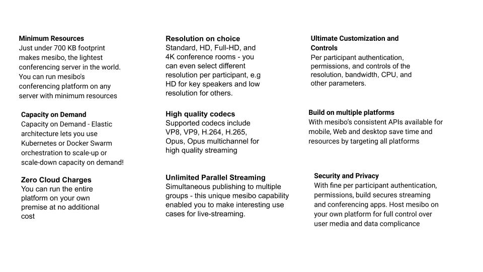

## mesibo Conferencing & Streaming Platform

Mesibo Conferencing and Streaming Platform is the lightest, highly scalable, and the most powerful platform to add group calling, live streaming, webinars, on-demand video to your apps in no-time.

### Linear Scalability	
mesibo's platform for conferencing is an elastic microservice architecture lets you use Kubernetes or Docker Swarm orchestration to scale-up or scale-down capacity on demand. For example, when you have more conference calls being made on your app, you can allocate more resource by spawning more instances and scale smoothly. You can add or remove instances on demand without affecting performance keeping your costs down and scale as per needs. 

For example, if your application is hosting around a 100 conferences on average, at a single point of time and assume you have allocated X amount of resources. For a sudden surge in growth, if you need to host  a 1000 conferences, you need to allocate more resources Y. Once you are past the surge, you will destroy the additional Y resources and go back to X . mesibo's platform smmothly adapts to all of this container resource orchestration at ease.

### Security and Control	
Mesibo provides you with fine grained control of your conference settings. With per participant authentication, permissions for who can view, who can connect to group stream, who can publish their stream, you can ensure that you build secure streaming and conferencing apps. 
You can also host mesibo platform on your own premise at no extra cost for full control over user data and data compliance

### Simulcast
Enable high quality streaming options at scale with adaptive  resolutions and framerates. Ensure the best experience for all your users without expensive bandwidth requirements. You can handle streams resolution on choice supporting standard, HD, Full-HD, and 4K conference rooms.  You can even select different resolution per participant, e.g HD for key speakers and low resolution for others. 

### Pricing
mesibo offers a transparent pricing model with no hidden charges. Zero commitments. There is no additional charge to your consumption of the streaming service. You are only charged for the bandwidth is consumed.

If you are hosting mesibo on your own servers using our on-premise offering (like most of our telemedicine customers) - the pricing will be $0.01 per user per month. No limits or charges on calls. https://mesibo.com/on-premise/ 

If you are using our cloud services, the server-side call charges will be $1 per GB  of media bandwidth. 

Typically an HD(720p and above) call, for 100 minutes will consume around 1 GB of bandwidth per participant. A non-HD call for 250 minutes consumes around 1GB per participant.

This translates to approximately $0.004 per minute for non-HD calls and $0.01 per minute for HD calls, per participant.

This means a 60-minute HD conference call, having 4 participants consumes 2.4 GB and so it will be priced at :
4 * ($0.01/min * 60 min) = $ 2.4

