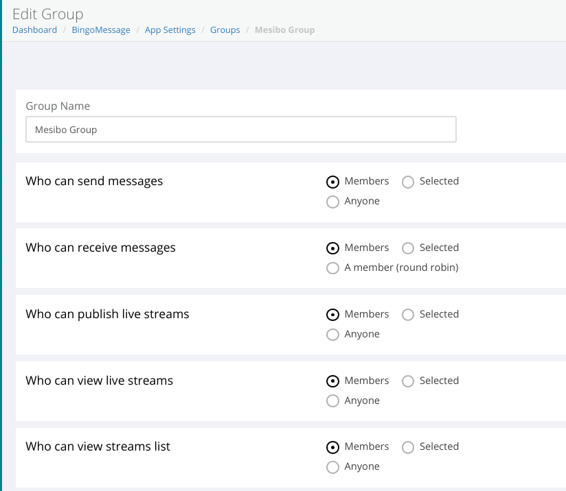
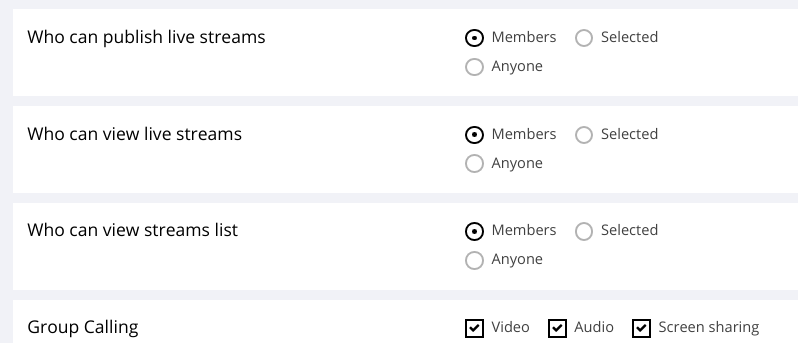
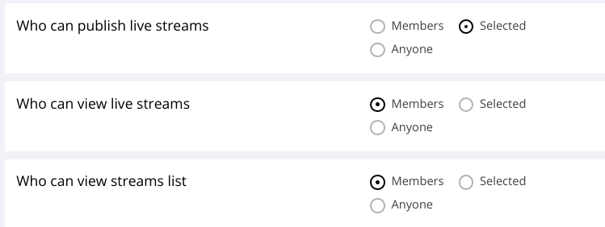

Mesibo Conferencing and Streaming Platform helps you build applications at scale for teleconferencing, virtual events, webinars, on-demand streaming, and more which can be deployed both on cloud and on-premise at no additional cost.

Mesibo offers a powerful combination of features to build any kind of conferencing and streaming application with minimal setup and cost.

## Why mesibo for conferencing?
- Just under 700KB footprint makes mesibo, the lightest conferencing server in the world. You can run mesibo's conferencing platform on any server with minimum resources.

- Capacity on Demand - Elastic architecture lets you use Kubernetes or Docker Swarm orchestration to scale-up or scale-down capacity on demand!

- Simultaneous publishing to multiple groups - this unique mesibo capability enables you to make interesting use cases for live-streaming.
Standard, HD, Full-HD, and 4K conference rooms - you can even select different resolutions per participant, e.g HD for key speakers, and low resolution for others.

- Per participant authentication, permissions, and controls of the resolution, bandwidth, CPU, and other parameters.
Run the entire platform on your premise at no additional cost.

- Native and web based offerings. No additional download required! 

> **Disclaimer**: The Conferencing and Streaming APIs are currently under development for more platforms and will be continuously updated. 

### Prerequisites
Before we dive into the various concepts and APIs for conferencing & streaming ensure that you are:

- Familiar with mesibo API. Please refer to [Getting Started](https://mesibo.com/documentation/get-started/) guide and and [First App Tutorial](https://mesibo.com/documentation/tutorials/first-app/#preparation) if you are not familiar.

- Familiar with [Group Management and Messaging APIs](https://mesibo.com/documentation/api/backend-api/#group-management-apis). 

# Mesibo Conferencing and Streaming 

Mesibo has made it simple to use and build with group calling and streaming APIs. In just a few steps, you can set up any type of streaming and conferencing application you need- webinar, virtual meeting and conferencing, live events and more. 

mesibo group calling simply extends the existing features of group messaging. In the case of group messaging you have a certain set of controls & permissions. With group calling, you just have an additional set of settings along with these permissions. Your existing groups will now have additional conferencing settings.

If you are already familiar with using [Mesibo Group Management APIs](https://mesibo.com/documentation/api/backend-api/#group-management-apis) feel free to skip ahead and learn about the conferencing features.

If not here's a little recap. 

### Fundamentals of Group Messaging & Group calling

Mesibo allows you to create groups having a set of users as group members. Once you create a group, you can send messages to the group, and all the group members will receive the messages. To set up a group with Mesibo APIs you follow the steps below:

1. Create a group.
2. Add Members.
3. Grant Permissions about who can send and received messages. For example, you can set permissions such that only members can send, only selected members can send, only Selected Members can receive, etc. You can also grant admin rights to who can change group settings, who can remove members, etc

In group messaging, when you send a message to the common group every member gets a message notification. The user opens the message and reads it. In the same way, in group calls, when you make a call to the group, every member of the group gets a call notification and each member of the group will connect with the call. 

You can restrict which member can send a message, who can only receive a message, etc. By specifying member behavior and permissions you can build [groups of different types](https://mesibo.com/documentation/api/backend-api/#group-management-apis). 



In the case of group messaging, each member has the following permissions:
- can send:  If the member can send messages to the group
- can receive: If the member can receive messages from the group

Now, for group calling, in addition to the group settings above, each member has the following permissions:
- can publish:  If the member can make (publish) group voice or video calls
- can subscribe: If the member can subscribe to group voice or video calls 
- can list: If the member can get a list of active callers in the group

Any type of conferencing and streaming app that you need can be easily configured with these controls. You can configure group level permissions as well as fine participant level permissions. Let's work with some examples and see how permissions can be set under different conditions.

### Conference
In a conference room, you need the members of the group to publish their stream and see other's streams. Every member will get a list of participants who are publishing their streams. They can then view the streams of each participant. Here's what your setting will look like in the console. We can selected `Members` only option for who can publish streams, who can view streams, who can view list of participants.



### Webinar
In a webinar you only need one(or a few more) members to be publishing. The other participants will only be listening or viewing the others. Other members will not be allowed to publish their streams. This can be achieved with the following group level permission levels. 


This is for an open webinar. In case of a members-only webinar, You can simply change the permission as follows
Who can view live streams: Members 
Who can view streams list: Members . 

### Class Room
If you have an online classroom, the teacher has the controls to change the permissions of the students. At the group level, you can set that only selected members can publish- The teachers.



The students by default do not have the permission to publish. By default, you can mute all the students. The teacher can dynamically set which student can talk when any clarification is needed. You can have this dynamic control, by individual member level permissions.


You can similarly build the set of required permissions for any scenario. In case of a video streaming app, You can upload media to the group, which only selected members can view on-demand, whenever they need it. All of this can be built by setting the different group calling and individual participant level permissions.

### Conference call Settings

Now that we have understood the basic concepts of group calling, let us go further by implementing the features required for conferencing.

For your conference calls, You can set the type of stream you need, such as audio or video or both. For example, you can have an audio-only group call. If you need to show a presentation or some charts, you need to enable screen sharing. You may choose to share multiple streams(simulcast) at once. Both your camera stream and desktop screen can be streamed simultaneously, with your camera feed streaming your self and the screen containing your presentation.

Next, decide what kind of quality you need for your calls. If you need to save some bandwidth or you are on a poor network, you may want to choose VGA. If you can have nothing but the highest quality live stream, select 4K! Mesibo provides you with a wide range of streaming quality options. Note that although you can enable the resolution required here in the console, your camera/device must support recording that resolution. It is recommended that you enable the resolution that best meets your bandwidth and device capacity.


You can set these features group wise permissions. You can override this participant level permissions using REST API. For example, in your conference you can make a setting such that only selected members can have the permission to publish video or share screen. In case of a webinar panel, you can set HD resolution for key speakers and low resolution for others, recording features for select participants, and so on.  

We will learn more on this in the further sections.

### Basic features of a conference 

The following are the basic features a conferencing application requires.

1. A conference room which people can join
2. Ability to get the list of participants which is updated as and when people join or leave the room in real-time
3. A participant should be able to publish the video or voice to the room
4. A participant should be able to view video published by other participants
5. Mute/Unmute and other controls
6. Authorization so that only rightful people can join the conference


In the following sections, we will learn how to meet the above requirements and how you can use Mesibo APIs to achieve this. We will be using two types of mesibo APIs:
1. Mesibo backend APIs for administrative tasks such as creating users, groups, etc.
2. mesibo Real-time APIs for real-time conferencing and streaming. These APIs are on the users’ side.

Let's get started.

## 1. Create the conference application

First, create a new application in [mesibo console](https://mesibo.com/console/). 

Click on the `+ CREATE NEW APPLICATION` button under My Applications section in the console. Enter the name of the application `conference` and click `Create`.

Once your application is created it will be visible in the `My Applications` table. Click on the Settings icon, to display the `App Settings` page for your app. 

In mesibo, the conference room is a group that allows communication between multiple users - that could be a video or a voice conference. Each group contains one or more users who will be participants of this conference call. In a real app, you create users on-demand using mesibo REST APIs (Private backend APIs) to perform the operations. We will explain both the ways of performing these operations, creating a group and adding users - using the console and using REST APIs

## 2. Creating the conference participants
To create users in the console, 

Click on `Users` section in your app.

Click on the `+ NEW USER` button. To create a user, Enter a User Address and App ID. For example, `basic room`  

Similarly,you can create more users.

For the actual application we can create users using private REST API, follow the steps below:

To enable real-time communication between your users, you need to let mesibo know about each of your users. Mesibo will create an access token for each user and give it to you which you can send it to your users. Your user can then use this access token in Mesibo Real-time APIs using setAccessToken function.

To add a user or to re-generate user access token, you need to invoke this API with the following parameters:

## 3. Creating the conference group
Go to [mesibo dashboard](https://mesibo.com/console/#/dashboard) and choose the application created earlier(conference) and click on the `Settings` icon. Now click on `Groups` to open the groups page.

To create a new group, click on the `+ NEW GROUP` button. Give a group name - example `ConferenceGroup` and click on `Create`. Your group with the name `ConferenceGroup` should now be created and be displayed in the table. Click on the edit icon, under actions. This will open the Group Settings page.

In a conference room, all the participants will be able to publish live streams and view live streams.


### Creating the group using REST API

To create a group, you need to invoke the [groupadd API](https://mesibo.com/documentation/api/backend-api/#create-a-group):

For example,
In case of a conference, members can send and recieve videos. So we create a normal group
```
https://api.mesibo.com/api.php?op=groupadd&token=xxxxxxxxxxxxx&name=conference&flag=0&active=1
```

A successfull response will contain will look like below:
```{"app":{"aid":"xxxx","uid":"xxx","name":"BingoMessage","secret":"","u_users":"46","u_groups":"13","url":"","server":"","notify":"1","nrate":"1","ninterval":"0","flag":"33024","f_beta":"1","ts":"1592816529","uts":"1592482004","fcm_id":"","fcm_key":"","apn_info":"","pushflags":"0","token":"xxxxxxxxxxxxxxxxxxxxxx"},"uts":"1593769608","disabled":0,"group":{"gid":97284},"op":"groupadd","result":true}
```
Make note of the group id. We will use this later to add members to the group
```
response[‘group’][‘gid’] = Group ID (GID)
```

## 4. Add Members

Now, let us add the users we created earlier as members of this group `ConferenceGroup`. Click on the `+ NEW MEMBER` button and enter the user address, of the user whom you wish to add. In the `User Address` enter `user0` and click on `Add`. The Members table will now display the member you just added. Similarly, add the more users. 

Add the users created earlier as members of the group.


### Adding members dynamically using REST API
Add or Remove Group Members using GID obtained in the group add operation.

To create a group, you need to invoke the [groupeditmembers API](https://mesibo.com/documentation/api/backend-api/#add-or-remove-group-members) 

For example,
In case of a conference, members can send and recieve videos. So we invoke the api as follows.
Let's say you have users with addresses `user0`, `user1`, `user2`, `user3`, `user4` that need to be members of the conference. Let all members have the permission to publish, subscribe and list. then you need to call the api as follows

```
https://api.mesibo.com/api.php?op=groupeditmembers&token=xxxxxxxxxxxxx&gid=12345&m=user0,user1,user2,user3,user4&canpub=1&cansub=1&canlist=1&delete=0
```

A successfull response will look like below
```
{"app":{"aid":"6320","uid":"1953","name":"BingoMessage","secret":"","u_users":"46","u_groups":"14","url":"","server":"","notify":"1","nrate":"1","ninterval":"0","flag":"33024","f_beta":"1","ts":"1592816529","uts":"1592482004","fcm_id":"","fcm_key":"","apn_info":"","pushflags":"0","token":"xxxxxxxxxxxxxxxxxxxx"},"uts":"1593770163","disabled":0,"op":"groupeditmembers","result":true}
```

### Mesibo Streaming and Conferencing SDK
We have released the streaming and conferencing Javascript SDK along with [a sample conferencing app](https://mesibo.com/livedemo) which is a fully functional, Zoom Like Video Conferencing app built using the same. You can also download the entire source code from [github](https://github.com/mesibo/conferencing).

The APIs for native mobile platforms are currently under developmment. 

### Client API

Let's now take a look at the different API functions that you can use to set up your conferencing and streaming platform.
Detailed documentation of each function/method can be found [here]() and will be explained with examples in the next section to build a zoom like conferencing app. 

Here is a brief overview of the different API methods and callbacks we will be using.

### Create a group
Use Mesibo's Group Management APIs to create a group. Add members and set permissions for the group members.

### Get the list of members
When any member joins the group, they will be getting a list of other members in the group. The callback function `Mesibo_onParticipant` will be called.

### Place a call to the group
To place a call to the group, first, you need to initialize the group call. For this, you need to use `initGroupCall()` which will provide you with a group call object and then link it with a group using `setRoom`. 

### Connect to voice and video of members
Once you get a list of participants, you can choose to connect to each of those streams. To connect to a participant's stream you need to use the `call` method. 

## 2. Getting a list of Participants

Other members, are also mesibo users who are part of the same group(conference room) as you(the publisher). Other group members are also publishing their streams.

Before we get the list of participants, first we need to initialize mesibo and connect to a group.

### Initialize mesibo
To initialize mesibo, create an instance of mesibo API class `mesibo`. Set the app id and token that you obtained while creating the user.
 
You can initialize and run mesibo as follows:
 
```javascript

var api = new mesibo();
api.setAppName(MESIBO_APP_ID);
api.setListener(new mesiboNotify(api));
api.setCredentials(MESIBO_ACCESS_TOKEN);
api.setDatabase("mesibo");
api.start();

```
### Initialize Group Calling & Streaming

To set up group calling and streaming call `initGroupCall()` to create the group call object. 
To link the room with a group, call the `setRoom` method of the group call object, by passing the group-id.

An example in Javascript is as follows,
```javascript
    
//Create group call object
var live = api.initGroupCall();

live.setRoom(DEMO_GROUP_ID);    
```

Now you will get a list of group members through the listener `Mesibo_onParticipants`. You can choose and subscribe to the stream of each member to view it. When a new participant joins the room, `Mesibo_onParticipants` will be called. 

```javascript

mesiboNotify.prototype.Mesibo_OnParticipants = function(all, latest) {    
    for(var i in latest) {
        console.log("Mesibo_Onparticipants: " + latest[i].getId());
        var p = latest[i];
        connectStream(p);
    }
}

```
The parameter `all` contains an array of all participants who have joined.
The parameter `latest` contains the array of participants that have just joined the group.

You can now iterate through the list of participants and subscribe to the stream of each participant.
```javascript
function connectStream(stream){
    for (var i = 0; i < streams.length; i++) {
        if(streams[i] == null){
            streams[i] = stream;
            streams[i].element_id = 'video-remote-'+ i;
            subscribe(streams[i]);
            return;
        }
    }
}
```

### 3. View the streams of participants in the group
You can subscribe to the stream of each participant  that you get in `Mesibo_onParticipants` as follows with the `call()` method
The `call` method takes the following parameters:
- The ID of the HTML element where the video will be rendered
- A callback function `on_stream` where you will be notified of the stream
- A callback function `on_status` where you will be notified when the mute status changes, there is a change in the quality of the stream if the participant has hung up, etc

For example, if the ID of the HTML element where the video will be displayed is `video-stream` then, we can connect to the call as follows:
```javascript
function subscribe(p) {
    console.log('====> subscribe', p.getId(), p.element_id);
    p.call(null, p.element_id, on_stream, on_status);
}


function on_status(p, status, video){
    if(MESIBO_CALLSTATUS_CHANNELUP == status){
        console.log(p.getName()+ 'is connected');
    }
    
    if(MESIBO_CALLSTATUS_COMPLETE == status){
        console.log(p.getName()+ 'has disconnected');
    }
}

function on_stream(p) {
    console.log('on_stream');

    //Local Stream
    if(p.isLocal()) {
        p.attach("video-publisher");
        return;
    }

    //Remote Stream
    console.log('===> on_stream', p.element_id, 'attach');
    p.attach(p.element_id);
}
```

### Publishing your self stream
Call the `getLocalParticipant` method to initialize local publisher(the stream you need to send) 
```javascript

// Create a local participant, Set Publisher name and address
var publisher = live.getLocalParticipant(USER_NAME, USER_ADDRESS); 
publish(publisher);
```    
You are the publisher. As a member of the conference room group, you can stream your self, which other members can view.
If the ID of the HTML Element is `video-publisher` then we publish as follows:

Call `streamFromCamera` when you need to send your camera stream.  
Call `streamFromScreen()` when you need to share your stream

```javascript
function streamFromCamera() {
    console.log('streamFromCamera');

    var o = {};
    o.peer = 0;
    o.name = DEMO_GROUP_NAME;
    o.groupid = DEMO_GROUP_ID;
    o.source = STREAM_CAMERA; 

    console.log('local publisher', o);

    publisher.call(o, "video-publisher", on_stream, on_status);
}

function streamFromScreen() {
        console.log('streamFromScreen');
    
    var o = {};
    o.peer = 0;
    o.name = DEMO_GROUP_NAME;
    o.groupid = DEMO_GROUP_ID;
    o.source = STREAM_SCREEN; 

    console.log('local publisher', o);

    publisher.call(o, "video-publisher", on_stream, on_status);
}

```

### Muting Streams

We can mute video and audio locally, for the streams that we are viewing. You can use the `toggleMute` method to toggle the audio and video status of a stream. 

```javascript
Stream.toggleMute(video, remote)
```
Parameters:
- `video` Boolean , `true` for video, `false` for audio
- `remote` Boolean, `true` for remote stream, `false` for local stream


For example, to mute audio and video of your own stream-- the publisher
```javascript
function toggleSelfVideo() {
    publisher.toggleMute(true, false);
}

function toggleSelfAudio() {
    publisher.toggleMute(false, false);
}


```
To mute remote stream, you use the same method, but the second parmeter is `false`
```javascript
function toggleRemoteVideo(i) {
    var s = streams[i];
    if(s)
        s.toggleMute(true, false);
}

function toggleRemoteAudio(i) {
    var s = streams[i];
    if(s)
        s.toggleMute(false, false);
}

```

### Getting the Mute Status of a stream

You can get the mute status of a stream with `muteStatus` which has the syntax as follows:
```javascript
Stream.muteStatus(video,remote)
```
Parameters:
- `video` Boolean , `true` for video, `false` for audio
- `remote` Boolean, `true` for remote source, `false` for local source

Example,
```javascript
    remote.muteStatus(true, false); // video mute status-local source
    remote.muteStatus(false, false); // audio mute status-local source
    
    remote.muteStatus(true, true); // video mute status-remote source
    remote.muteStatus(false, true); // audio mute status-remote source
```


