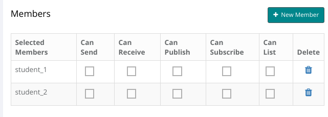

Mesibo Conferencing and Streaming Platform helps you build applications at scale for teleconferencing, virtual events, webinars, on-demand streaming, and more which can be deployed both on cloud and on-premise at no additional cost.

Mesibo offers a powerful combination of features to build any kind of conferencing and streaming application with minimal setup and cost.

## Why mesibo for conferencing?
- Standard, HD, Full-HD, and 4K conference rooms - you can even select different resolutions per participant, e.g HD for key speakers, and low resolution for others.

- Multiple screen sharing - not just the one. Allows your participants to share multiple screens if requires.

- Simultaneous publishing to multiple groups - this unique mesibo capability enables you to make interesting use cases for live-streaming.

- Per participant authentication, permissions, and controls of the resolution, bandwidth, CPU, and other parameters.

- Run the entire platform on your premise at no additional cost. The elastic architecture lets you run multiple instances to scale-up or scale-down capacity on demand. Mesibo offers you options to scale manually or use Kubernetes or Docker Swarm orchestration.

- Just under 700KB footprint makes mesibo, the lightest conferencing server in the world. You can run mesibo's conferencing platform on any server with minimum resources.

- Native and web-based offerings. No additional download required! 

> **Disclaimer**: The Conferencing and Streaming APIs are currently under continuous development hence and will be continuously updated. 

### Prerequisites
Before we dive into the various concepts and APIs for conferencing & streaming ensure that you have gone through following and you are well familiar with mesibo APIs. 

- [Get Started Guide]({{ '/documentation/get-started/' | relative_url }}).

- Tutorial on [Writing your First mesibo Enabled Application]({{ '/documentation/tutorials/first-app/' | relative_url }}).

- Familiar with [Group Management and Messaging APIs](https://mesibo.com/documentation/api/backend-api/#group-management-apis). 

### Terminology

In this document, we will be using the following terms

- Confernce - Group Call, Webinar, live streaming, etc. For the purpose of this document, we will refer all the use cases as Conference. 
- Stream - video (camera, screen, etc) and voice data
- Participant - a user participating in the conference
- Publishing - publishing/sending self video and voice stream to the conference
- Subscribing - Receiving video and voice stream of other participants

## Mesibo Conferencing and Streaming 

Mesibo has made it simple to use and build with the group calling and streaming APIs. In just a few steps, you can set up any type of streaming and conferencing application you need- webinar, virtual meeting and conferencing, live events, and more. 

It is assumed that you are already familiar with mesibo group messaging. mesibo group calling simply extends the existing features of group messaging with additional permissions and control, for example, room resolution, talk detection, who can publish and who can video, voice+video or voice only, etc. Your existing groups will now have additional conferencing settings.

### Fundamentals of Group Messaging & Group calling

Mesibo allows you to create groups having a set of users as group members. Once you create a group, you can send messages to the group, and all the group members will receive the messages. You only need to do the following to set up a group with mesibo APIs:

1. Create a group with required permissions and settings
2. Add Members (participants)
3. Grant Permissions about who can send and receive messages. 

That's it. Now members can start sending and receiving messages in the group.

The group calling is no different, just that you have additional permissions for who can call to group (publishing) and who can view/listen to the group calls (subscribing).


In the case of group messaging, each member has the following permissions:
- can send:  If the member can send messages to the group
- can receive: If the member can receive messages from the group

Now, for group calling, in addition to the group settings above, each member has the following permissions:
- can publish:  If the member can make (publish) group voice or video calls
- can subscribe: If the member can subscribe to group voice or video calls 
- can list: If the member can get a list of active callers in the group

This allows you to create a type of conferencing and streaming app. You can configure default group-level permissions as well as per participant level permissions. The following are some examples of how permissions can be set under different conditions.

### Conference / Group Calling
In a conference/group calling app, you require that all the members of the group publish their stream and subscribe to other's streams. Also, all the members should be able to get a list of participants who are publishing their streams so that they can subscribe to them. Hence the suggested group setting is as shown below. We have selected `Members` only option for who can publish streams, who can view streams, who can view the list of participants.


### Open Webinar / Panel discussion
In an open webinar or panel discussion apps, you generally require that only one or selected participants are publishing and rest are subscribers only. Other members will not be allowed to publish their streams. This can be achieved with the following group level permission levels.
 


In case of a members-only webinar, You can simply change the permission as follows

 - Who can view live streams: Members 
 - Who can view streams list: Members 

### Class Room
In a classroom app, the teacher has the controls to change the permissions of the students. At the group level, you can set that only selected members can publish - usually the teachers.


The students by default do not have the permission to publish. By default, you can mute all the students. The teacher can dynamically set which student can talk when any clarification is needed. You can have this dynamic control, by individual member level permissions.



You can create any kind of scenario just by setting the right permission. 

### Conference call Settings

In addition to permission, you can set various properties like resolution, media, bitrate control, etc. for each group. 

You can decide the default resolution for the conference room. Mesibo supports all the conference room resolution, from normal to 4K. Mesibo has an adaptive algorithm to change the bitrate and resolution depending on the network condition, which is ON by default. However, you can disable it if you like.  Note that although you can select the resolution in the console, your camera/device must support that resolution. It is recommended that you enable the resolution that best meets your bandwidth and device capacity.

You can enable default media types (voice or video or both) allowed in your conference room. For example, a normal conference room will have both voice and video. However, you can also create a voice-only room by disabling video. Alternatively, you can only allow subscribers to access for video and voice but only allow asking questions using voice. 

Similarly, you can enable screen-sharing for participants to share one or more screens during the conference. 

Mesibo also allows you to enable simulcast in which each publisher can publish the same stream in different resolutions to cater to subscribers having different bandwidth and devices. Note that, enabling simulcast increases CPU and bandwidth usage significantly. 


You can override these settings per participant using the mesibo REST API. For example, in your conference, you can make a setting such that only selected members (key speakers) can publish in HD resolution and others in low resolution, and so on.  

We will learn more about this in the further sections.

## How to create a conferencing app using mesibo API 

The following are the basic requirements of a conferencing app.

1. A conference room which people can join
2. Ability to get the list of participants which is updated as and when people join or leave the room in real-time
3. A participant should be able to publish the video or voice to the room
4. A participant should be able to view video published by other participants
5. Mute/Unmute and other controls
6. Group and one-to-one chat
7. Authorization so that only rightful people can join the conference


In the following sections, we will learn how to use Mesibo APIs to achieve this. We will be using two types of mesibo APIs:

1. Mesibo backend APIs for administrative tasks such as creating groups, adding participants, etc.

2. mesibo Real-time APIs for real-time conferencing and streaming. These APIs are on the users’ side.

Let's get started.

### 1. Create the conference application

First, create a new application in [mesibo console](https://mesibo.com/console/). You can skip this step if you already have an existing app.

Click on the `+ CREATE NEW APPLICATION` button under My Applications section in the console. Enter the name of the application `conference` and click `Create`.

Once your application is created it will be visible in the `My Applications` table. Click on the Settings icon, to display the `App Settings` page for your app. 

In mesibo, the conference room is a group that allows communication between multiple users - that could be a video or a voice conference. Each group contains one or more users who will be participants of this conference call. In a real app, you create groups and participants on-demand using mesibo REST APIs. We will explain both the ways of performing these operations, creating a group and adding users - using the console and using REST APIs

### 2. Creating the conference participants (users)
To create users in the console, 

Click on the `Users` section in your app.

Click on the `+ NEW USER` button. To create a user, Enter a User Address and App ID. For example, `conf.mesibo.com`  

Similarly, you can create more users.

To enable real-time communication between your users, you need to let mesibo know about each of your users. Mesibo will create an access token for each user and give it to you which you can send it to your users. Your user can then use this access token in Mesibo Real-time APIs using `setAccessToken` function.

To add a user, you need to invoke [useradd](https://mesibo.com/documentation/api/backend-api/#add-a-user--regenerate-a-user-access-token)

### 3. Creating the conference group
Go to [mesibo dashboard](https://mesibo.com/console/#/dashboard) and choose the application created earlier(conference) and click on the `Settings` icon. Now click on `Groups` to open the groups page.

To create a new group, click on the `+ NEW GROUP` button. Give a group name - example `ConferenceGroup` and click on `Create`. Your group with the name `ConferenceGroup` should now be created and be displayed in the table. Click on the edit icon, under actions. This will open the Group Settings page. Replicate settings shown below.


### Creating the group using REST API

You can also create a group using [mesibo backend APIs](https://mesibo.com/documentation/api/backend-api/#create-a-group):

For example,
```
https://api.mesibo.com/api.php?op=groupadd&token=xxxxxxxxxxxxx&name=conference&flag=0
```

This will return the group ID in a JSON response. Make note of the group id. We will use this later to add members to the group

```
{"group":{"gid":12345},"op":"groupadd","result":true}
```

### 4. Add Members

Now, let us add the users we created earlier as members of this group `ConferenceGroup`. Click on the `+ NEW MEMBER` button and enter the user address, of the user whom you wish to add. In the `User Address` enter `user0` and click on `Add`. The Members table will now display the member you just added. Similarly, add more users. 

Add the users created earlier as members of the group.


### Adding members dynamically using REST API
Add or Remove Group Members using GID obtained in the group add operation.

To create a group, you need to invoke [groupeditmembers](https://mesibo.com/documentation/api/backend-api/#add-or-remove-group-members) 

For example,
In the case of a conference, members can send and receive videos. So we invoke the API as follows.
Let's say you have users with addresses `user0`, `user1`, `user2`, `user3`, `user4` that need to be members of the conference. Let all members have permission to publish, subscribe, and list. then you need to call the API as follows

```
https://api.mesibo.com/api.php?op=groupeditmembers&token=xxxxxxxxxxxxx&gid=12345&m=user0,user1,user2,user3,user4&canpub=1&cansub=1&canlist=1&delete=0
```

## Client API

Once you have created a group and added your users as members, your users can start conferencing using client-side API. Below is a description of each API. You can refer to our open source conferencing app source code in GitHub for better understanding. It is assumed that you are familiar with mesibo real-time APIs.

Here is a brief overview of the different API methods and callbacks we will be using.

### Initialize mesibo
First, initialize mesibo by creating an instance of mesibo API class `Mesibo`. Set the app id and token that you obtained while creating the user.
 
```javascript

//Create Mesibo API instance
var api = new Mesibo();

//Set Application ID
api.setAppName(MESIBO_APP_ID);

//Create Mesibo Listener object and set it 
api.setListener(new mesiboNotify(api));

//Set the user access token
api.setCredentials(MESIBO_ACCESS_TOKEN);

//Set the database name to store messages,etc
api.setDatabase("mesibo");

//Run Mesibo
api.start();

```
### Initializing the group call 

To set up group calling and streaming, call `initGroupCall()` to create the group calling object. 

To link the room with a group, call the `setRoom` method of the group call object, by setting the group-id.

An example in Javascript is as follows,
```javascript

//Create group call object
var gCall = api.initGroupCall();

//Set the room's ID
//Example,
const GROUP_ID = 98765;

live.setRoom(GROUP_ID);    
```
### Making Calls to the group

Group users participate in the conference by making calls to the group. There are two kinds of call:
 
  - **publish call** to publish self video or voice stream. In subsequent sections, we will refer to as publishing.
  - **subscribe call** to receive other participants video or voice stream. In subsequent sections, we will refer to as subscribing.

Participant can publish multiple streams simultaneously by making multiple publish calls. Similarly partipants can view other participants streams by making multiple subscribe calls. There is no limit on these calls.

When a participant makes a publish call (publishing), all the participants will receive a corresponding call object which they can use to make subscribe call.

### Publishing 
You publish your stream, you need to create a participant before making a call. Call the `getLocalParticipant` method to create a local participant and then use call method to publish your stream. You can create and publish multiple streams simultaneously, for example, one camera, two screens, one whiteboard, etc.

Syntax
```javascript
GroupCall.getLocalParticipant(streamId, participantName, participantAddress)
```

Arguments  
- **streamId** - Arbitrary stream identifier. You can publish multiple streams(share multiple camera streams or screen shares) with a unique identifier for each stream. The remote end will receive the streamId you set here along with the call object.

- **participantName** - Set the name of the local participant

- **participantAddress** - Set the address of the local participant(This is the address you set when you created this user).

Returns  
`Call object` for the participant

Example,
```javascript
// Create a local participant, Set Publisher name and address
var publisher = gCall.getLocalParticipant(0, 'user_name', 'user_address');
```
### Overview of Methods available in the Participant object. 

- **Participant.call()** - To establish a connection to the participant to get the video/audio stream
- `Participant.attach()` To display the stream in an HTML media element (<video> or <audio>)
- `Participant.getName()` Returns the name of the participant - initialized in `getLocalParticipant` by the publisher
- `Participant.getAddress()` Returns the address of the participant
- `Participant.getType()` Returns an integer, the streamId - initialized in `getLocalParticipant` by the publisher
- `Participant.getId()` Returns an integer, the mesibo user-id of the publisher 
- `Participant.toggleMute()` To mute the audio or video of a stream
- `Participant.muteStatus()` To get the mute status of a stream
- `Participant.hangup()` Hangup the stream 

## Making a call 
To place a call to the group, you can use the `call` method on the stream object. 

### The basic concept of a call
You need to make a call when you need other members of group to view your streams. You get a call object from `getLocalParticipant`. Then, if you make a `call()`, other members of the group will be notified and will receive your call object. Other members can then subscribe to your stream, again using `call()`

Syntax
```javascript
Stream.call(initObject, elementId, onStreamCallback, onStatusCallback)
```
Arguments
- `initObject` Initialization object where you can initialize various properties of the stream like:
    * `audio` Set to `true` to enable audio, `false` otherwise
    * `video` Set to `true` to enable video, `false` otherwise
    * `source` Set to `1` to stream from the camera. Set to `2` to share screen. 

- `elementId` The ID of the video element where the stream is to be displayed. 
- `onStreamCallback` A function which will be called when the stream is created
- `onStatusCallback` A function which will be called when the status of a stream changes. For example, if the mute status changes, or there is a change in the quality of the stream, if the participant has hung up, etc. Refer to https://api.mesibo.com/mesibo.js for the various status indicator constants.

For example, if the ID of the HTML element where the video will be displayed is `video-stream` and we want to enable both audio and video , we can make the call as follows:
```javascript
    var o = {};
    o.audio = true; //Set to false to disable audio
    o.video = true; //Set to false to disable video
    
    p.call(o, 'video-stream', on_stream, on_status);

    //Called when a stream is formed 
    function on_stream(p) {
        //Attach the stream to the HTML element    
    }

    //Called when the status of a stream changes
    function on_status(p, status){
        //Stream is Connected
    }

    if(MESIBO_CALLSTATUS_COMPLETE == status){
        //Stream is disconnected
    }
    }

```
### Attaching a stream
To display a stream, you need to call the `attach` method on the stream object. 

Syntax
```javascript
Stream.attach(elementId, onAttachedCallback, retryTimeout, maxRetries)
```

Arguments
- `elementId` The ID of the HTML element where the stream is to be displayed
- `onAttachedCallback` Function to be called when attach is finished
- `retryTimeout` Time in milliseconds, after which attach will be called again if the previous attach failed
- `maxRetries` Maximum number of retries to attach

Example,
```javascript
function on_attached(isAttached){
    //isAttached is `true` if attach on the element is successful
    //isAttached is `false` if attach on the element fails 
}

//Calls attach every 100ms, for a maximum number of 50 times, until successful 
p.attach('video-publisher', on_attached, 100, 50);

```

### Sending your stream to the group 
As a member of the conference room group, you can send your streams to the group, which other members of the group can view.

If you want to display your own video in an HTML video element with the id `video-publisher` like below
```html
<video id="video-publisher" autoplay playsinline muted/>
```

You can send two types of streams.
```
const STREAM_CAMERA = 1;
const STREAM_SCREEN = 2;
```

If want to send your camera feed to the group, we set the source as `STREAM_CAMERA` &  make a call as follows

```javascript
    var o = {};
    o.source = STREAM_CAMERA; 
    
    //publisher is the stream object initialized by getLocalParticipant()
    publisher.call(o, "video-publisher", on_stream, on_status);

    function on_stream(p) {
    p.attach('video-publisher', on_attached, 100, 10);
    }

    function on_status(p, status){
    if(MESIBO_CALLSTATUS_CHANNELUP == status){
        console.log(p.getName()+ ' is connected');
    }

    if(MESIBO_CALLSTATUS_COMPLETE == status){
        console.log(p.getName()+ ' has disconnected');
    }
    }

   function on_attached(isAttached){
    console.log('Element is attached '+ isAttached);
   }

}
```

If you  want to share your screen with the group, we set the source as `STREAM_SCREEN` &  make a call as follows
```javascript
    var o = {};
    o.source = STREAM_SCREEN; 

    //publisher is the stream object initialized by getLocalParticipant()
    publisher.call(o, "video-publisher", on_stream, on_status);
}

```
### Publishing multiple screens
Note that you can simultaneously be publishing as many streams as you like. For example, in a conference you can share multiple screens at the same time. Or if you have multiple camera devices, you can share multiple camera feed at the same time. 

For every stream you want to publish, initialize a stream object using `getLocalParticipant` with a unique stream-id and then place a `call()` 

On the other end, the members of the group will be able to see multiple streams with different `stream-id` from you. They will be able to subscribe to each of your streams seperately.

For example, to share multiple screen initialize a stream object using `getLocalParticipant` with a **unique stream-id** for each screen you want to share. On the remote end where they receive your stream, they can read this stream-id using `stream.getType()` 

```javascript
// A local participant object for each stream is required
var screen_1 = gCall.getLocalParticipant(1, 'user_name', 'user_address');
var screen_2 = gCall.getLocalParticipant(2, 'user_name', 'user_address');
var screen_3 = gCall.getLocalParticipant(2, 'user_name', 'user_address');
 
var o = {};
o.source = STREAM_SCREEN; 
screen_1.call(o, "video-screen-1", on_stream, on_status);
screen_2.call(o, "video-screen-2", on_stream, on_status);
screen_3.call(o, "video-screen-3", on_stream, on_status);
```

### Get a list of participants

You will get a list of participants through the listener `Mesibo_onParticipants`. You can choose and subscribe to the stream of each member to view their stream. When a new participant joins the room, `Mesibo_onParticipants` will be called. 

Syntax
```javascript
Mesibo_OnParticipants(all, latest)
```

Arguments
- `all` contains an array of all participants who have joined.
- `latest` contains the array of participants that have just joined the group.

Example,
```javascript

mesiboNotify.prototype.Mesibo_OnParticipants = function(all, latest) {    
    for(var i in latest) {
        var p = latest[i];
        //Now you can subscribe to each of these participants;
    }
}
```

### Subscribe to the participant's stream
You can view the stream of each participant that you get in `Mesibo_onParticipants`, by connecting to stream as follows with the `call()` method

```javascript

mesiboNotify.prototype.Mesibo_OnParticipants = function(all, latest) {    
    for(var i in latest) {
        var p = latest[i];
        //Subscribe to the stream of  each of these participants;
        
        //Each participant's video will have a separate video element.
        //So we append the UID of each participant to `video-stream-` to create
        //a unique element ID
        p.call(null, 'video-stream-'+ p.getId(), on_stream, on_status);

        //Called when you get the stream 
        function on_stream(p) {
            //Attach the stream to the HTML element
            p.attach('video-stream-'+ p.getId());
        }

        //Called when the status of a stream changes
        function on_status(p, status){
            if(MESIBO_CALLSTATUS_CHANNELUP == status){
                console.log(p.getName()+ 'is connected');
            }

            if(MESIBO_CALLSTATUS_COMPLETE == status){
                console.log(p.getName()+ 'has disconnected');
            }
        }
    }
}

```
### Viewing multiple streams from a participant
Each stream published by a participant will have a different stream-id. You can get the stream-id using the method `getType()` .
For example, let's say we have participant sharing three screens at once. Now, in this case `Mesibo_OnParticipants` will contain three participant stream objects, all with the same uid (`getId()` will give you the same user-id, since they are from the same user) but different screen-id (`getType()` will give you the screen-id that was set by the publisher for that stream).

So, if we want to display these multiple screens from the same participant we need to have different HTML element ID's. Then our call function will look something like below:
```javascript
var element_id = 'video-stream-'+ p.getId()+'-type-'+ p.getType();
p.call(null, element_id , on_stream, on_status);

function on_stream(p) {
    //Attach the stream to the HTML element
    var element_id = 'video-stream-'+ p.getId()+'-type-'+ p.getType();
    p.attach(element_id);
}
```

For example, suppose we have a participant with a user-id `1234` and they are sharing three screens in a conferences. Each screen will have a differnt stream-id set by the publisher. Suppose the stream_ids are  `1`, `2`, `3`. If we want to display all of them simultaneously, we need to have three HTML elements.

```html
<video id="video-stream-1234-type-1" autoplay playsinline muted/>
<video id="video-stream-1234-type-2" autoplay playsinline muted/>
<video id="video-stream-1234-type-3" autoplay playsinline muted/>
```

In `Mesibo_OnParticipants` we will have three stream  `p1`, `p2`, `p3` such that :
```
p1.getId() == p2.getId() == p3.getId() == 1234

p1.getType() == 1, p1.getType() == 2, p1.getType() == 3
```

To subsctibe to each of the streams, we need to perform `call()` on each stream like below:
```javascript
p1.call(null, "video-stream-1234-type-1" , on_stream, on_status);
p2.call(null, "video-stream-1234-type-2" , on_stream, on_status);
p3.call(null, "video-stream-1234-type-3" , on_stream, on_status);
```
and the call attach on these different HTML element IDs do display them.

### Muting Streams

We can mute video and audio locally, for the streams that we are viewing. You can use the `toggleMute` method to toggle the audio and video status of a stream. 

```javascript
Stream.toggleMute(video, remote)
```
Parameters:
- `video` Boolean , `true` for video, `false` for audio
- `remote` Boolean, `true` for remote stream, `false` for local stream

`toggleMute` allows you to mute your own video/audio and also other participant's audio/video. But, if you mute your own audio and video others who are viewing your stream will get a mute status. But, if you are viewing the streams of other participants and you mute them it will only affect what you are seeing/hearing. Other parties are unaffected.

For example, to mute audio and video of your stream-- the publisher
```javascript
//Mute own audio
publisher.toggleMute(true, false);
    
//Mute own video
publisher.toggleMute(false, false);
```
When you do this, on the remote end , whoever is subscribed to your stream, will be notified through  `Mesibo_OnParticipantUpdated`
```javascript
mesiboNotify.prototype.Mesibo_OnParticipantUpdated = function(all, p) {    
    console.log(p.getName()+ ' is updated');
}
```

To mute a remote stream, you use the same method, but the second parameter is `true`
```javascript
//Mute remote video 
subscriber.toggleMute(true, true);

//Mute remote audio
subscriber.toggleMute(false, true);
}
```

### Getting the Mute Status of a stream

You can get the mute status of a stream with `muteStatus` which has the syntax as follows:
```javascript
Stream.muteStatus(video, remote)
```
Parameters:
- `video` Boolean , `true` for video, `false` for audio
- `remote` Boolean, `true` for remote source, `false` for local source

Returns:
`true` if muted, `false` otherwise

For example,
Say the remote video is muted by the remote participant then,
`subscriber.muteStatus(true, true)` will return `true`

> Note that, When a remote participant mutes `Mesibo_OnParticipantUpdated` will be called. Then you need to update the participant object that you are viewing and then call `muteStatus()` to get the updated mute status.

If you have muted the video locally then,
`subscriber.muteStatus(true, false)` will return `true` 


### Stopping a stream
To view a stream from a participant you need to subscribe to it using `call()`.  
To stop viewing a stream, you can need to use `hangup()`. It is like disconnecting a call.

Example,
```javascipt
publisher.hangup()
```
When you call `hangup` on a stream that you are publishing, people who are viewing your stream will be notified of it. 
The remote end will get the status `MESIBO_CALLSTATUS_COMPLETE`.
```javascript
on_status(p, status){
 if(MESIBO_CALLSTATUS_COMPLETE == status)
  //Stream has been disconnected. Cleanup..
}
```
When you get a hangup status from a participant, you may need to cleanup. For example, If you are displaying that stream from a participant, you need to stop displaying it and remove that participant.
