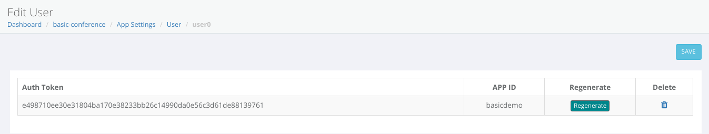

Once you have created your application, it’s time to add users and groups. Typically, you will add users and groups dynamically on aneed basis. Note that, on an actual app, you will be using mesibo backend APIs to create users on-demand.

However, for this sample app, you can create a few users and groups manually so that you can test messaging between them. So, let uscreate users in the console directly. Follow the steps below: 

Once your application is created it will be visible in the `My Applications` table. Click on the Settings icon, to display the `App Settings` page for your app.

Click on the `+ NEW USER` button. To create the user, Enter a User Address and App ID. 

To create our first user, enter the address as `firstuser` and the app id as `demo`. Then click `Create`. The `user0` should now be displayed in the table. 

Similarly you can create many more users.

Now for a user to login to mesibo, you will need an access token.
> An access token is different from the App token. App Token is secret and you should never expose it to your users. Hence, you MUST not use it in client-side APIs (Android, iOS, JS, etc). You should only use access token.

To get a token for a user, click on the `Edit` icon. Now in the `Edit User` page, copy the `Auth Token`. Replace the `TOKEN_USER_0` with the token you just copied.

Make note of this access token, we will be using this later to write our first Mesibo Application. 

