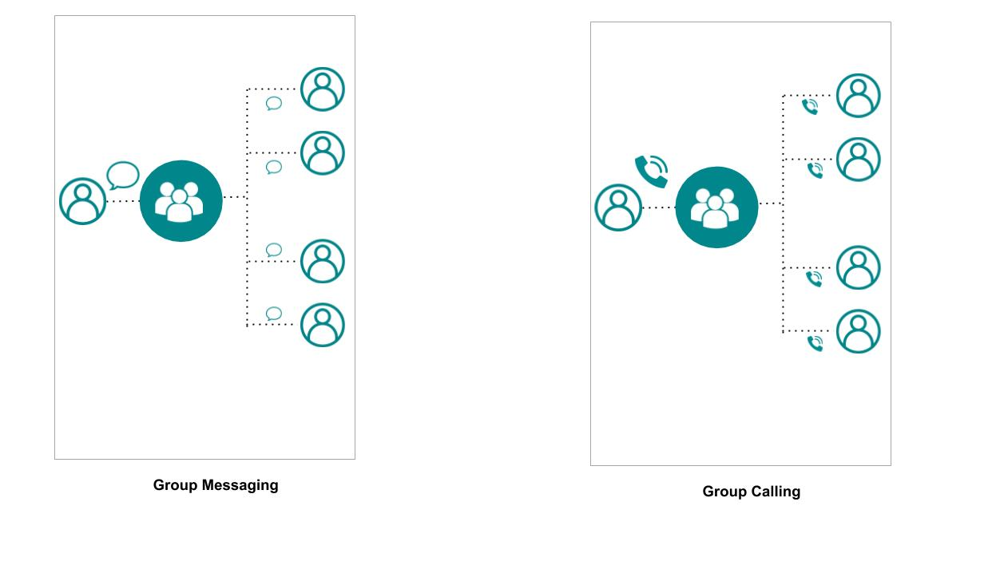
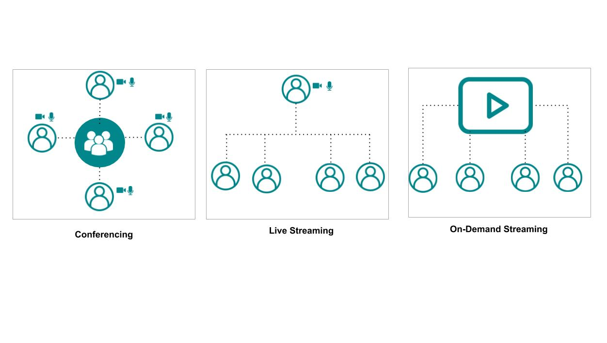
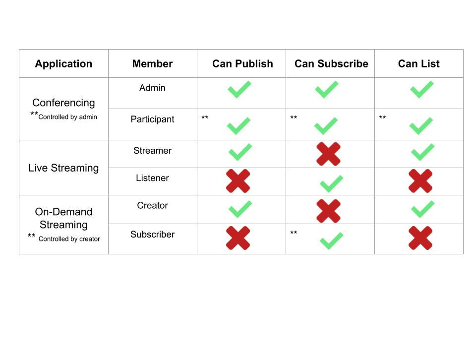

Video conferencing apps like Zoom and Google Meet are showing new ways for people to virtually collaborate and connect. Streaming services like Netflix, Youtube, Prime Video, etc have forever changed the way people consume entertainment and media. Imagine if you can build such applications with minimal setup and cost, to deploy for your own use cases. 

With Mesibo Live Conferencing and Streaming Platform, this is now a reality. You can build applications at scale for teleconferencing, virtual events and webinars, on-demand streaming and more - all at no additional cost with an on-premise platform!

This article consists of two parts. In the first part, we will understand how group calling works by simply extending the concept of group messaging. In the next part, we will build a fully functional Zoom like conferencing application. You can try the [live demo](https://mesibo.com/livedemo) and download the source code from [github](https://github.com/mesibo) 

> **Disclaimer** : The Live Conferencing and Streaming APIs are currently under development for more platforms and will be continously updated. Please ensure that you are using the latest version of Mesibo APIs and refering to updated documentation

# How do Mesibo Live Platform APIs work?
Mesibo has made it extremely simple to use and build with group calling and streaming APIs. Mesibo conferencing and streaming can be readily integrated with your existing applications which are using Mesibo messaging and call APIs.

Mesibo APIs for conferencing, simply extend the core features offered by mesibo [Group Management and Messaging APIs](https://mesibo.com/documentation/api/backend-api/#group-management-apis). So, there is absolutely no need to learn anything additional.

If you are not familiar with using [Mesibo Group Management APIs](https://mesibo.com/documentation/api/backend-api/#group-management-apis), here's a little recap. Feel free to skip ahead if you are already familiar with group messaging.


## Group Messaging
Mesibo allows you to create groups having a set of users as group members. Once you create a group, you can send messages to the group, and all the group members will receive the messages. To set up a group with Mesibo APIs you follow the steps below:

1. Create a group.
2. Add Members.
3. Grant Permissions about who can send and received messages. For example you can set permissions such that only members can send, only selected members can send, only Selected Members can receive, etc. You can also grant admin rights to who can change group settings, who can remove members, etc

## Extending Group Messaging to Group Calling
In group messaging, when you send a message to the common group every member gets a message notification. The user opens the message and reads it. In the same way, in group calling, when you make a call to the group, every member of the group get's a call notification and each member of the group will connect with the call. 

So, for live conferencing and streaming there is a small addition to setting up a group.

1. Set up group
2. Get the list of members  
2. Place a call to group   
4. Connect to each member of the group over voice and video.

It is that simple!

Remember how you can specify member behaviour in case of group messaging? You can restrict which member can send a message,who can only recieve message, etc. By specifying member behaviour and permissions you can build [groups of different types](https://mesibo.com/documentation/api/backend-api/#group-management-apis). 

In case of group messaging, each member has the following permissions:
- can send
- can receive

Now, for group calling, each participant has the following permissions:
- can publish
- can subscribe
- can list

You can build any type of conferencing and streaming app that you need by configuring these group calling permissions.
 


- **Conferencing**: A many-to-many group. All members of the group can publish their own stream and see other's streams. There can also be admins or moderators who have special permissions to change group settings, remove participants, mute members, etc. Apps like Zoom, Google Meet,etc are examples of this.

- **Live Streaming**: A one-to-many group. Only one person has been granted the permission to publish. All other members can only receive the stream ie; They are just listeners. An online webinar, a live class, are examples of such a scenario.

- **On-Demand Streaming** You can upload media to the group, which only members can view on-demand, whenever they need it. You can think of Youtube and Netflix as an example of such applications.



Let's now take a look at the different API functions that you can use to set up your conferencing and streaming platorm.
A detailed documentaion of each function/method can be found [here]() and will be explained with examples in the next section to build a zoom like conferencing app. 

### Create a group
Use Mesibo's Group Management APIs to create a group. Add members and set permissions for the group members.

### Get list of members
When any member joins the group, they will be getting a list of other members in the group. The callback function `Mesibo_onParticipant` will be called.

### Place a call to group
To place a call to the group, first you need initialize the group call. For this you need to use `initGroupCall()` which will provide you with a group call object and then link it with a group using `setRoom`. 

### Connect to voice and video of members
Once you get a list of participants, you can choose to connect to each of those streams. To connect to a participant's stream you need to use the `call` method. 

# Mesibo Live Demo App

In this section we will build Mesibo Live- a video conferencing app like Zoom. Before you proceed, please make sure that you have read the prerequisites and are familiar with mesibo APIs.

### Prerequisites

- This demo use Mesibo Javascript SDK. So, install Mesibo Javscript SDK by following the instructions [here](https://mesibo.com/documentation/install/javascript/)
- Familiar with Mesibo [User and Group Management APIs](https://mesibo.com/documentation/api/backend-api/#group-management-apis)
- Familiar with the basic concepts of how Mesibo APIs for streaming and conferencing work

### Basic features required for video conferencing 

We need the following features.
1. A conference room which people can join
2. A list of participants and a way to update the list of participants as and when people join or leave the room
3. View the videos of participants in the group
4. Send my own video, to the group.

You can checkout the [live demo](https://mesibo.com/livedemo) and download the source code from [github](https://github.com/mesibo).

## 1. Creating a Conference Room

The conference room is a group. Only the members of a group, will be able to view the streams of other members of the same group. 

### Creating a User
Before creating a group, we need to create a mesibo user for the admin. We will be using the token that we receive in this step - the access token of the admin user, while creating the group in the next step. Note that anyone who wants to join the group, also need to be a mesibo user with a token. 

So, for the first step we need to create a login form, where we authenticate them and generate a token for them. 

1. We will ask for the name and email of the user and send an OTP to their email. To do this send a request with the following parameters to send an OTP to the email of the user.
```
https://app.mesibo.com/conf/api.php?op=login&appid=APP_ID&name=NAME&email=USER_EMAIL
```
2. The user will now need to enter the OTP receieved which we then send to backend for verification with the following request
```
https://app.mesibo.com/conf/api.php?op=login&appid=APP_ID&name=NAME&email=USER_EMAIL&code=OTP_RECEIVED
```
If the entered OTP matches, we generate a token for that user, you will receive a token in the response. Save the token. You can refer to the `getMesiboDemoAppToken()` function in `login.js`.


### Creating a Group
For a conference room we need to create a group that other people can join. The creator of the room, will configure all the room properties.

For better safety and privacy, we can also set a pin or password to our group. When anyone needs to enter the group they need to enter this pin. This is optional. If you do not need this, do not use the pin parmeter while sending the request.

For simplicity, we will only set the room name and pin for now. We will be creating a normal group where all members can send and receive streams.

If you are hosting [Mesibo Backend](https://github.com/mesibo/messenger-app-backend), modify the REST Endpoint accordingly.
Here, we will use `https://app.mesibo.com/conf/api.php`.

You can create a group, by making a request in the following format:
```
https://app.mesibo.com/conf/api.php?token=USER_ACCESS_TOKEN&op=setgroup&name=ROOM_NAME&pin=ROOM_PIN
```

For example, to create a group named `mesibo` you can use the API as follows.
```
https://app.mesibo.com/conf/api.php?token=9adbur3748chhsdj8ry88y8fy33fkj&op=setgroup&name=mesibo&pin=1234
```


## 2. Getting a list of Participants

Other members, are also mesibo users who are part of the same group(conference room) as you(the publisher). Other group members are also publishing their own streams.

Before we get the list of participants, first we need to initialize mesibo and connect to a group.

### Initialize Mesibo
To initialize Mesibo, create an instance of Mesibo API class `Mesibo`. Set the app id and token that you obtained while creating the user.
 
You can initialize and run mesibo as follows:
 
```javascript

    var mesibo = new Mesibo();
    mesibo.setAppName(MESIBO_APP_ID);
    mesibo.setCredentials(MESIBO_ACCESS_TOKEN))
    var listener = new MesiboNotify(mesibo);
    mesibo.setListener(listener);
    mesibo.setDatabase("mesibo");
    mesibo.start();

```
### Initialize Group Calling & Streaming

To set up group calling and streaming call `initGroupCall()` to create the group call object. 
To link the room with a group, call the `setRoom` method of the group call object, by passing the group-id.

An example in Javascript is as follows,
```javascript
    
    //Create group call object
    var live = mesibo.initGroupCall(); 
    
    //Set Group ID
    live.setRoom(GROUP_ID);     
```

Now you will get a list of group members through the listener `Mesibo_onParticipants`. You can choose and subscribe to the stream of each member to view it. When a new participant joins the room, `Mesibo_onParticipants` will be called. 

```javascript

MesiboNotify.prototype.Mesibo_OnParticipants = function(all, latest) {
	for(var i in latest) {
		var p = latest[i];
		subscribe(p);			
	}
}

```
The parameter `all` contains an array of all participants who have joined.
The parameter `latest` contains the array of participants that have just joined the group.

You can now iterate through the list of participants and subscribe to the stream of each participant.

### 3. View the streams of participants in the group
You can subscribe to the stream of each participant  that you get in `Mesibo_onParticipants` as follows with the `call()` method
The `call` method takes the following parameters:
- The ID of the HTML element where the video will be rendered
- A callback function `on_stream` where you will be notified of the stream
- A callback function `on_status` whre you will be notified when the mute status changes, there is a change in quality of the stream,etc

For example, if the ID of the HTML element where the video will be displayed is `video-stream` then, we can connect to the call as follows:
```javascript
function subscribe(p){
	p.call(null, 'video-stream', on_stream, on_status);
}

function on_status(p, status, video){
	if(MESIBO_CALLSTATUS_CHANNELUP == status){
		console.log(p.getName()+ 'is connected');
	}
	
	if(MESIBO_CALLSTATUS_COMPLETE == status){
		console.log(p.getName()+ 'has disconnected');
	}
}

function on_stream(p){
	p.attach('video-stream');
}
```
Now, we will have multiple streams in our conference room, from different participants. So, the ID of the HTML Element where the video will be rendered will be different for each user. So, we need to make a small change to the subscribe function.
```javascript
function subscribe(p){
	p.call(null, 'video-stream', on_stream, on_status);
}
```

### Publishing your self stream
Call the `getLocalParticipant` method to initialize local publisher(the stream you need to send) 
```javascript

// Create a local participant, Set Publisher name and address
var publisher = live.getLocalParticipant(USER_NAME, USER_ADDRESS); 
publish(publisher);
```    
You are the publisher. As a member of the conference room group you can stream your own self, which other members can view.
If the ID of the HTML Element is `video-publisher` then we publish as follows:

```javascript
function publish(publisher){
	var o = {};
	o.groupid = GROUP_ID;	
	o.source = '720p';	   

	publisher.call(o, 'video-publisher', on_stream, on_status);
}
```
The available quality options for the source are `180p`,`240p`,`360p`,`480p`,`720p`,`1080p`,`2160p`

### Muting Streams
We can mute video and audio locally, for the streams that we are view. For this there are methods available in the stream object. For muting video, we use the method `toggleMute(true)` and for muting audio we use the method `toggleMute(false)`.

For example, to mute audio and video of your own stream-- the publisher
```javascript
	publisher.toggleMute(false); //Mute Audio
	publisher.toggleMute(true); //Mute Video
```

### Getting the Mute Status of a stream
`muteStatus(true, false)` gives the local video mute status  
`muteStatus(false, false)` gives the local audio mute status
`muteStatus(true, true)` gives the remote video mute status  
`muteStatus(false, true)` gives the remote audio mute status

Example,
```javascript
	stream.muteStatus(true, false);
	stream.muteStatus(false, true);
	
	stream.muteStatus(true, true);
	stream.muteStatus(false, true);
```
# Building the App

