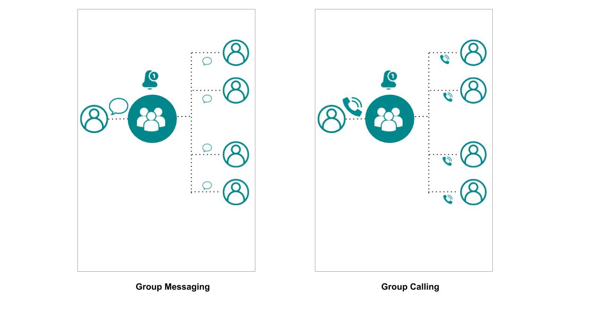

Mesibo Live Conferencing and Streaming Platform helps you  build applications at scale for teleconferencing, virtual events and webinars, on-demand streaming and more - all at no additional cost with an on-premise platform!

This article consists of two parts. In the first part, we will understand how group calling works by simply extending the concept of group messaging. In the next part, we will build a fully functional Zoom like conferencing application. You can try the [live demo](https://mesibo.com/livedemo) and download the source code from [github](https://github.com/mesibo) 

> **Disclaimer** : The Live Conferencing and Streaming APIs are currently under development for more platforms and will be continously updated. Please ensure that you are using the latest version of Mesibo APIs and refering to updated documentation

# How do Mesibo Live Platform APIs work?
Mesibo has made it extremely simple to use and build with group calling and streaming APIs. Mesibo conferencing and streaming can be readily integrated with your existing applications which are using Mesibo messaging and call APIs.

Mesibo APIs for conferencing, simply extend the core features offered by mesibo [Group Management and Messaging APIs](https://mesibo.com/documentation/api/backend-api/#group-management-apis). So, there is absolutely no need to learn anything additional.

If you are not familiar with using [Mesibo Group Management APIs](https://mesibo.com/documentation/api/backend-api/#group-management-apis), here's a little recap. Feel free to skip ahead if you are already familiar with group messaging.


## Group Messaging
Mesibo allows you to create groups having a set of users as group members. Once you create a group, you can send messages to the group, and all the group members will receive the messages. To set up a group with Mesibo APIs you follow the steps below:

1. Create a group.
2. Add Members.
3. Grant Permissions about who can send and received messages. For example you can set permissions such that only members can send, only selected members can send, only Selected Members can receive, etc. You can also grant admin rights to who can change group settings, who can remove members, etc

## Extending Group Messaging to Group Calling
In group messaging, when you send a message to the common group every member gets a message notification. The user opens the message and reads it. In the same way, in group calling, when you make a call to the group, every member of the group get's a call notification and each member of the group will connect with the call. 

So, for live conferencing and streaming there is a small addition to setting up a group.

1. Set up group
2. Get the list of members  
2. Place a call to group   
4. Connect to each member of the group over voice and video.

It is that simple!

Remember how you can specify member behaviour in case of group messaging? You can restrict which member can send a message,who can only recieve message, etc. By specifying member behaviour and permissions you can build [groups of different types](https://mesibo.com/documentation/api/backend-api/#group-management-apis). 

In case of group messaging, each member has the following permissions:
- can send
- can receive

Now, for group calling, each participant has the following permissions:
- can publish
- can subscribe
- can list

You can build any type of conferencing and streaming app that you need by configuring these group calling permissions.
 


- **Conferencing**: A many-to-many group. All members of the group can publish their own stream and see other's streams. There can also be admins or moderators who have special permissions to change group settings, remove participants, mute members, etc. Apps like Zoom, Google Meet,etc are examples of this.

- **Live Streaming**: A one-to-many group. Only one person has been granted the permission to publish. All other members can only receive the stream ie; They are just listeners. An online webinar, a live class, are examples of such a scenario.

- **On-Demand Streaming** You can upload media to the group, which only members can view on-demand, whenever they need it. You can think of Youtube and Netflix as an example of such applications.


Let's now take a look at the different API functions that you can use to set up your conferencing and streaming platorm.
A detailed documentaion of each function/method can be found [here] and will be explained with examples in the next section 

### Create a group
Use Mesibo's Group Management APIs to create a group. Add members and set permissions for the group members.

### Get list of members
When any member joins the group, they will be getting a list of other members in the group. The callback function `Mesibo_onParticipant` will be called.

### Place a call to group
To place a call to the group, first you need initialize the group call. For this you need to use `initGroupCall()` which will provide you with a group call object.

### Connecting to voice and video of members
Once you get a list of participants, you can choose to connect to each of those streams. 

# Mesibo Live Demo App

In this section we will build Mesibo Live- a functional conferencing application like Zoom. Let us first design the app, by listing out our requirements. Here's what we need:
1. A conference room which people can join
2. A list of participants and a way to update the list of participants as and when people join or leave the room
3. View the streams of participants in the group
4. Send my ownstream, to the group.

You can try the [live demo](https://mesibo.com/livedemo) and download the source code from [github](https://github.com/mesibo).

## 1. Creating a Conference Room

The conference room is a group. We will use REST APIs to perform the operations to create a group and join a group on Mesibo backend. Only the members of a group, will be able to view the streams of other members of the same group.

### Creating a User
Before creating a group, we need to create a mesibo user for the admin. We will be using the token that we receive in this step - the access token of the admin user, while creating the group in the next step. Note that anyone who wants to join the group, also need to be a mesibo user with a token. 

So, for the first step we need to create a login form, where we authenticate them and generate a token for them. 

1. We will ask for the name and email of the user and send an OTP to their email. To do this send a request with the following parameters to send an OTP to the email of the user.
```
https://app.mesibo.com/conf/api.php?op=login&name=NAME&email=USER_EMAIL
```
2. The user will now need to enter the OTP receieved which we then send to backend for verification with the following request
```
https://app.mesibo.com/conf/api.php?op=login&name=NAME&email=USER_EMAIL&code=OTP_RECEIVED
```
If the entered OTP matches, we generate a token for that user, you will receive a token in the response. Save the token. You can refer to the `getMesiboDemoAppToken()` function in `login.js`.


### Creating a Group
For a conference room we need to create a group that other people can join. The creator of the room, will configure all the room properties.

For better safety and privacy, we can also set a pin or password to our group. When anyone needs to enter the group they need to enter this pin. This is optional. If you do not need this, do not use the pin parmeter while sending the request.

For simplicity, we will only set the room name and pin for now. We will be creating a normal group where all members can send and receive streams.

If you are hosting [Mesibo Backend](https://github.com/mesibo/messenger-app-backend), modify the REST Endpoint accordingly.
Here, we will use `https://app.mesibo.com/conf/api.php`.

You can create a group, by making a request in the following format:
```
https://app.mesibo.com/conf/api.php?token=USER_ACCESS_TOKEN&op=setgroup&name=ROOM_NAME&pin=ROOM_PIN
```

For example, to create a group named `mesibo` you can use the API as follows.
```
https://app.mesibo.com/conf/api.php?token=9adbur3748chhsdj8ry88y8fy33fkj&op=setgroup&name=mesibo&pin=1234
```
### Getting a list of Participants
Other members, are also mesibo users who are part of the same group(conference room) as you(the publisher). Other group members are also publishing their own streams.

Once you join a room, you get a list of other group members through the callback function `Mesibo_onParticipant`. You can choose and subscribe to the stream of each member to view it. Mesibo will be listening for any members leaving or joining the group and will inform you through appropriate callback functions.

There is no limit to the number of groups that you can create with Mesibo. Or the number of participants a group can have.
So, unlike other streaming platforms or services, Mesibo does not impose any limit on the total number of participants in a single group call.

### Setting Up Mesibo Group Calling
First initialize and Run Mesibo.

To initialize Mesibo, create an instance of Mesibo API class `Mesibo`. 
 For example, you can initialize and run mesibo as follows:
 
```javascript
$scope.initMesibo = function(){

    var mesibo = new Mesibo();
    mesibo.setAppName(MESIBO_APP_ID);
    if( false == mesibo.setCredentials(MESIBO_ACCESS_TOKEN))
        return -1;

    mesibo.setListener($scope);
    mesibo.setDatabase("mesibo");
    mesibo.start();

    initializeStreaming();
    
    return 0;
}
```
### Initialize Group Calling & Streaming

After initializing Mesibo, To set up group calling and streaming call the `initGroupCall` method to create the group call object.

Call the `getLocalParticipant` method to initialize publisher(your self stream) 

An example in javascript is as follows,
```javascript
function initializeStreaming(mesibo) {

    //Create group call object
    var live = mesibo.initGroupCall(); 
    
    //Set Group ID
    live.setRoom(GROUP_ID); 
    
    // Create a local stream object, Set Publisher name and address
    var publisher = live.getLocalParticipant(USER_NAME, USER_ADDRESS); 
    if(!isValid(publisher))
        	return -1; 
    
    return 0;
}          
```
### Publishing your self stream
You are the publisher. As a member of the conference room group you can stream your own self and send messages to other members. T

```javascript
function publish(publisher){
	var o = {};
	o.groupid = GROUP_ID;	
	o.source = '720p';	   
	
        publisher.call(o, 'video-publisher', on_stream, on_status);
}
```

## Callback Functions
Various callback functions are called for different events such as when a participant enters the room, 


