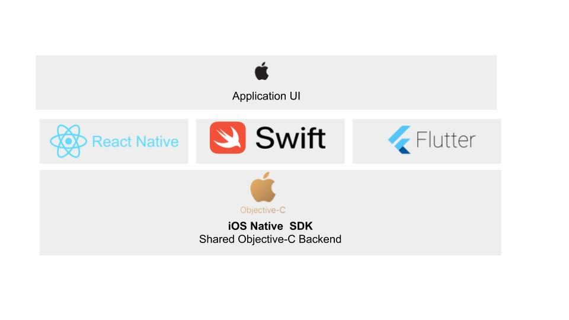

## Cross Platform Application Development With Mesibo

Frameworks and libraries like React-Native, Flutter, Swift etc have made it possible to quickly build applications for Mobile and Web .It is simple to build applications which are cross platform while also ensuring native performance. 

Although, you will be using a framework (say React-Native or Swift) to write your app, under the hood, it invokes the native APIs in Objective-C (for iOS) or Java (for Android). The general idea is ,a channel or a bridge connects the UI part built using the framework and application logic part built using the Native SDK. 
  

### Integrating Mesibo for cross platform development

[Mesibo](https://mesibo.com) allows you to quickly add real-time messaging, voice and video calling into your mobile Apps, and Websites.
  - Enable 1-to-1 messaging, group chat, or add a chatbot in your apps or website
  - Add high quality voice chat between users
  - Adding real-time video calling in your apps
  
You can add communication capabilities to your application using Mesibo - a communication platform. To integrate with a framework on top of this platform you need to connect or interface with the native SDK. 

Mesibo APIs are provided as a Native SDK for Android, iOS and Web . Because of this, Mesibo can be integrated into any application on a platform of your choice by interfacing with the native API. 

In the following sections we look at integrating Mesibo with some of the popular frameworks. Sample applications and documentation for is also provided using which you can quickly get started with using Mesibo in your apps.

First we will look at how you can interface with  Native SDK in Android(using Flutter as an example) and interface with Native SDK in iOS (using Swift as an example). Then we will see some examples and sample application for interfacing Mesibo with popular frameworks like React-Native, Xamarin, Ionic,etc

## Interfacing  Android Native SDK in Flutter
Let us take a look at calling Native components in Android . Here, we shall take the example of [Flutter](https://flutter.dev/) that is used to build the application UI and connect it with the Native Android SDK. 

## Flutter
[Flutter](https://flutter.io/) by Google is a new framework that allows us to build beautiful native Apps on iOS and Android from a single codebase. To integrate Flutter with Mesibo Android SDK you need to use [platform channels](https://flutter.dev/docs/development/platform-integration/platform-channels).

The user interface is developed using Flutter which interacts with Mesibo Native API. To call Native Components in Android you need to access Java code in Flutter. To do this you need to use a method channel.

- The Flutter portion of the app sends commands to its host to perform actions.Here ,the host is Mesibo which controls ,the iOS or Android portion of the app, over a platform channel.For example ,to send a message you just need to enter the access token for your application and the destination user address.

- Mesibo listens on the platform channel, and receives the information about the action to be performed. In the case of sending a message, it will receive a "Send Message" command from flutter ,upon which Mesibo calls into any number of platform-specific APIs—using the native programming language to send a message to the destination user address entered—and sends a response back to the client, the Flutter portion of the app.

Refer to the sample application tutorial for integrating [Flutter with Mesibo](https://github.com/mesibo/samples/tree/master/flutter).

Follow the steps below for calling [Native API from Android](https://flutter.dev/docs/development/platform-integration/platform-channels):

### Step-1: Create the Flutter platform client
Implement a MethodChannel with a single platform method that connects the client UI and Android Host.The client and host sides of a channel are connected through a channel name passed in the channel constructor.

### Step-2: Add an Android platform-specific implementation using Java
Start by opening the Android host portion of your Flutter app in Android Studio:

Start Android Studio

1. Select the menu item File > Open…

2. Navigate to the directory holding your Flutter app, and select the android folder inside it. Click OK.

3. Open the MainActivity.java file located in the java folder in the Project view.

Next, create a MethodChannel and set a MethodCallHandler inside the onCreate() method.

### Step-3: Build your application
Now your application will be able to interface with the Android Native SDK component from Flutter UI client.

## Interfacing iOS Native SDK in Swift

Let us take a look at calling Native components in iOS. Here, we shall take the example of [Swift](https://developer.apple.com/swift/) that is used to build the application UI and connect it with the Native iOS SDK.  
To call Native Components in iOS you need to access Objective-C code in Swift. To do this you need to use an Objective-C bridging header file to expose those files to Swift.

## Swift
[Swift](https://developer.apple.com/swift/) is a fantastic way to write software, whether it’s for phones, desktops, servers, or anything else that runs code. To integrate Swift with Mesibo Objective-C SDK you need to use [Bridge Headers](https://developer.apple.com/documentation/swift/imported_c_and_objective-c_apis/importing_objective-c_into_swift).

Follow the steps below for [Importing Objective-C in Swift](https://developer.apple.com/documentation/swift/imported_c_and_objective-c_apis/importing_objective-c_into_swift)

### Step-1: Import Code Within an App Target
Xcode offers to create the bridge header when you add a Swift file to an existing Objective-C app, or an Objective-C file to an existing Swift app. The created header file will be your product module name followed by "-Bridging-Header.h". Alternatively, you can create a bridging header yourself by choosing File > New > File > [operating system] > Source > Header File.

### Step-2: Expose Objective-C code to Swift
Edit the bridging header to expose your Objective-C code to your Swift code:

1. In your Objective-C bridging header, import every Objective-C header you want to expose to Swift.

2. In Build Settings, in Swift Compiler - Code Generation, make sure the Objective-C Bridging Header build setting has a path to the bridging header file. The path should be relative to your project, similar to the way your Info.plist path is specified in Build Settings. In most cases, you won't need to modify this setting.

### Step-3: Import Code Within a Framework Target
Import your Objective-C files by configuring the umbrella header:

1. Under Build Settings, in Packaging, make sure the Defines Module setting for the framework target is set to Yes.

2. In the umbrella header, import every Objective-C header you want to expose to Swift.

Now, your application will interface with the iOS Native SDK Component from Swift.

 
## React Native
[React Native](https://facebook.github.io/react-native/) is a way to develop mobile apps using React and JavaScript.
To integrate React Native with Mesibo you need to create a native module that acts as a bridge between Mesibo and React-Native.

Refer to the sample application tutorial for integrating [React Native with Mesibo](https://github.com/mesibo/samples/tree/master/react-native/helloworld)

## Xamarin
Xamarin lets you build native apps for Android, iOS, and macOS using .NET code and platform-specific user interface.
Xamarin  supports the use of native libraries via the standard PInvoke mechanism. To integrate Mesibo with Xamarin refer to the documentation for integrating Native Libraries

## Ionic

