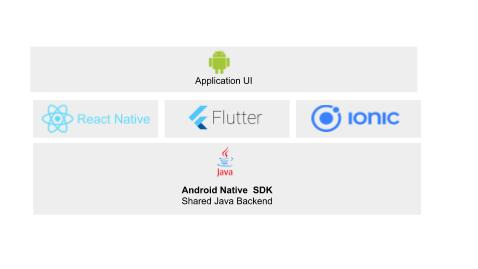

Cross-Platform frameworks and libraries like React-Native, Flutter, Swift, etc. have made it possible to build applications for Mobile and Web quickly.  In this article, we will briefly talk about various cross-platform tools and how to use mesibo in your favorite cross-platform tool.
## Ionic

It is worth remembering that although each cross-platform tool has it's own language and APIs, under the hood, it invokes native APIs - that is Objective-C (for iOS) or Java (for Android). In short, all the cross-platform APIs are wrappers around the native APIs, as shown below.

<p float="left" align="middle">
   
 
## Ionic
## Ionic
</p>

However, it is sometimes not possible to cover all the native APIs and programming scenarios by cross-platform tools. Hence, all such cross-platform tools provide a way to access the native APIs from the cross-platform APIs.

mesibo APIs are provided as a Native SDK for Android, iOS, and Web. Since all the cross-platform tools offer a way to access native APIs, you can use mesibo from the platform of your choice. In the following sections, we'll look at integrating mesibo with some of the popular frameworks like Flutter, Swift, React-Native, Xamarin, Ionic, etc. Sample applications and documentation are also provided using which you can quickly get started with using mesibo in your cross-platform apps.

## Access mesibo APIs from Cross-Platform Frameworks

### Flutter
[Flutter](https://flutter.io/) by Google is a new framework that allows us to build cross-platform Apps on iOS and Android from a single codebase. 

To integrate Flutter with native APIs (such as mesibo) you need to use [platform channels](https://flutter.dev/docs/development/platform-integration/platform-channels).

- The Flutter portion of the app sends commands to its native side to perform actions. Here, the native side is Mesibo which controls, the iOS or Android portion of the app, over a platform channel.

- Mesibo listens on the platform channel, and receives the information about the action to be performed. For exaple, in the case of sending a message, it will receive a "Send Message" command from flutter, upon which Mesibo calls into any number of platform-specific APIs using the native programming language to send a message to the destination.

Refer to the sample application tutorial for integrating [Flutter with Mesibo](https://github.com/mesibo/samples/tree/master/flutter).

### Flutter Android
Follow the steps below for calling [Native API from Android](https://flutter.dev/docs/development/platform-integration/platform-channels):

#### Step-1: Create the Flutter platform client
Implement a MethodChannel with a single platform method that connects the client UI and Android Host.The client and host sides of a channel are connected through a channel name passed in the channel constructor.

#### Step-2: Add an Android platform-specific implementation using Java
Start by opening the Android host portion of your Flutter app in Android Studio:

Start Android Studio

1. Select the menu item File > Open…

2. Navigate to the directory holding your Flutter app, and select the android folder inside it. Click OK.

3. Open the MainActivity.java file located in the java folder in the Project view.

Next, create a MethodChannel and set a MethodCallHandler inside the onCreate() method.

#### Step-3: Build your application
Now your application will be able to interface with the Android Native SDK component from Flutter UI client.

### Flutter iOS 
Follow the steps below for calling [Native API from iOS](https://flutter.dev/docs/development/platform-integration/platform-channels#example-objc):

Note: The following steps use Objective-C. If you prefer Swift, [refer](https://flutter.dev/docs/development/platform-integration/platform-channels#example-swift) 


#### Step-1: Add an iOS platform-specific implementation using Objective-C 
Start by opening the iOS host portion of the Flutter app in Xcode:

1. Select the menu item File > Open…

2. Navigate to the directory holding your Flutter app, and select the ios folder inside it. Click OK.

3. Make sure the Xcode projects builds without errors.

4. Open the file AppDelegate.m, located under Runner > Runner in the Project navigator.

Create a FlutterMethodChannel and add a handler inside the application didFinishLaunchingWithOptions: method. Make sure to use the same channel name as was used on the Flutter client side.

#### Step-2: Build your application
Now your application will be able to interface with the iOS Native SDK component from Flutter UI client.


### Swift
[Swift](https://developer.apple.com/swift/) is an another way to write software for iOS. 

To use Mesibo from Swift, you need to use [Bridge Headers](https://developer.apple.com/documentation/swift/imported_c_and_objective-c_apis/importing_objective-c_into_swift). 

Once you include bridge headers in your code, you can use all the mesibo APIs from your Swift app.

#### Step-1: Import Code Within an App Target
Xcode offers to create the bridge header when you add a Swift file to an existing Objective-C app, or an Objective-C file to an existing Swift app. The created header file will be your product module name followed by "-Bridging-Header.h". Alternatively, you can create a bridging header yourself by choosing File > New > File > [operating system] > Source > Header File.

#### Step-2: Expose Objective-C code to Swift
Edit the bridging header to expose your Objective-C code to your Swift code:

1. In your Objective-C bridging header, import every Objective-C header you want to expose to Swift.

2. In Build Settings, in Swift Compiler - Code Generation, make sure the Objective-C Bridging Header build setting has a path to the bridging header file. The path should be relative to your project, similar to the way your Info.plist path is specified in Build Settings. In most cases, you won't need to modify this setting.

#### Step-3: Import Code Within a Framework Target
Import your Objective-C files by configuring the umbrella header:

1. Under Build Settings, in Packaging, make sure the Defines Module setting for the framework target is set to Yes.

2. In the umbrella header, import every Objective-C header you want to expose to Swift.

Now, your application will interface with the iOS Native SDK Component from Swift.

 
### React Native
[React Native](https://facebook.github.io/react-native/) is a way to develop mobile apps using React and JavaScript.
To integrate React Native with Mesibo you need to create a native module that acts as a bridge between Mesibo and React-Native.

Refer to the sample application tutorial for integrating [React Native with Mesibo](https://github.com/mesibo/samples/tree/master/react-native/helloworld)

Follow the steps below:
1. Create a new react-native project and initialise it. 
```
react-native init ProjectMesibo
```
This will provide you `App.js` where you need to develop your UI component in Javascript.

2.Create a native module that acts as a bridge between Mesibo and React-Native. For example , `MesiboModule.js`

```javascript
import {NativeModules} from 'react-native';
module.exports = NativeModules.MesiboModule;

```
3. Import Mesibo SDK and initialize it in the native part of Android/iOS
For example in Android 
```java
import com.mesibo.api.mesibo;
```

4. Now,edit `App.js` to add UI components and call Mesibo Methods by importing `MesiboModule.js`
```javascript
import MesiboModule from './MesiboModule';

```
5. Start the React Native server and run your native app.

That's it! You have sucessfully integrated Mesibo with React-Native.


## Xamarin
Xamarin lets you build native apps for Android, iOS, and macOS using .NET code and platform-specific user interface.
Xamarin  supports the use of native libraries via the standard PInvoke mechanism. To integrate Mesibo with Xamarin refer to the documentation for integrating Native Libraries.

For Android, refer [Using Native Libraries in Xamarin.Android](https://docs.microsoft.com/en-us/xamarin/android/platform/native-libraries)


For iOS, refer [Referencing Native Libraries in Xamarin.iOS](https://docs.microsoft.com/en-us/xamarin/ios/platform/native-interop)


