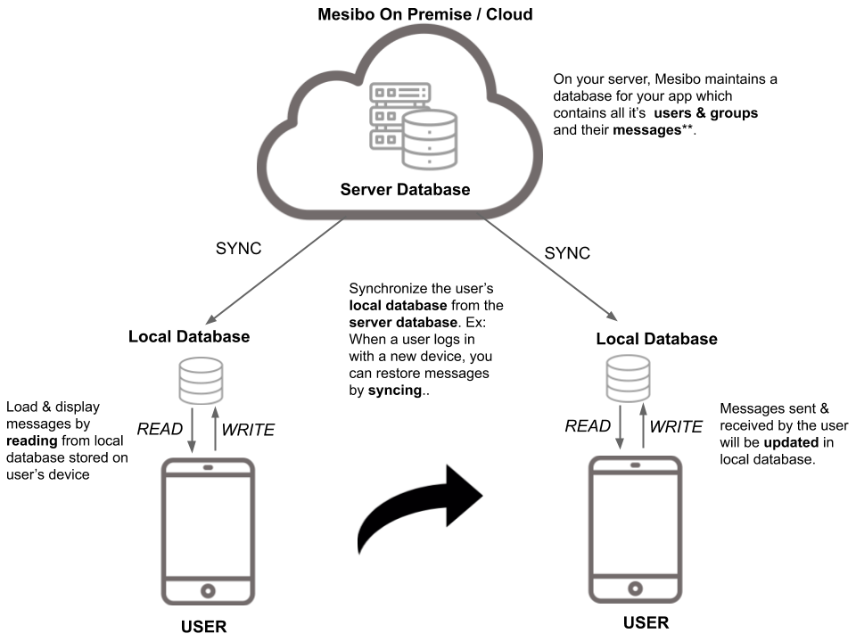



In this part, we will learn about synchronizing messages and user data on multiple devices with mesibo. 

## Prerequisites
You MUST go through the following prerequisites before you read further.

- Read the [First App]({{ '/documentation/tutorials/get-started/first-app/' | relative_url }}) Guide.
- Read one of the Android, iOS, JS, etc of this tutorial.
- Get familiar with [Reading APIs]({{ '/documentation/tutorials/get-started/reading-messages' | relative_url }})

## Multi-Device Synchronization 
Mesibo stores the app data (messages & call logs, etc) on a local database on the user's device. To display messages to the user, you need to read messages(Using [Read APIs]({{ '/documentation/tutorials/get-started/reading-messages/#how-to-read-messages' | relative_url }})) from this local database. Now, if the user moves to a new device you will have a brand new database. Your user cannot view the old messages by reading the new database. The messages & other data present in the old database, stored on the old device is not available. So, if you want to read the old data on a new device you need to synchronize the new database with the old database. 


## Synchronization 
When you use the `read` API you will be accessing the local database stored on the user's device. For example, in Android to read messages sent/received from a user with the address `"dest"` you call read as follows:
```java
Mesibo.ReadDbSession mReadSession = new Mesibo.ReadDbSession("dest", 0, null, this);
int count = mReadSession.read(100)
```
Once you call `read()`, it reads the local database and checks if there are messages for the user called `"dest"`. It will return the number of messages and you will be getting `count` number of messages for that user through the listener `Mesibo_OnMessage`.  

But when your user logs in on a new device, and you call `read()` for the first time, it will not give you any messages ie; `count` will be `0`. Because the new database will be initially empty and may not contain any messages for the user you have attempted to `read`. You need to sync the database on the new device to include messages for the selected user/group, from the one on the previous device. You may think, you need to transfer all of the data from the previous database to the new one. But, this is not a feasible approach. You only need to `sync` messages for the selected user on demand.

To perform this on-demand synchronization mesibo provides the `sync` API.

## Using the sync API
When your call to `read()` returns zero messages, you may request for a `sync` as follows.
```cpp
void* read_session = m_api->set_readsession(read_session, MESIBO_FLAG_READRECEIPT, "dest", 0, "");
int c = m_api->read(read_session, 10);
if(c == 0){
	// Check for messages from the server database;
	m_api->sync(read_session, 200);
}
```
Note that a call to `read()` is synchronous while the call to `sync()` is asynchronous. The result of your `sync`
request will be avialble through the listener `on_sync`. The call to `sync` checks messages stored on the mesibo server and transfers those messages to your local database. The number of messages that have been synced will be available as a parameter `count` in the `on_sync` listener. You can read `count` number of messages using `read()`.
```cpp
void on_sync(const void *rs, int count, uint32_t flags){
	ERRORLOG("=>>>>>> on_sync: rs %p count %d flags 0x% " PRIx32 "  \n", rs, count, flags);
        if(count > 0 && rs != NULL){
        	int c = 0;
                c = m_api->read((void*)rs, count);
        }
}
```

## How sync works

