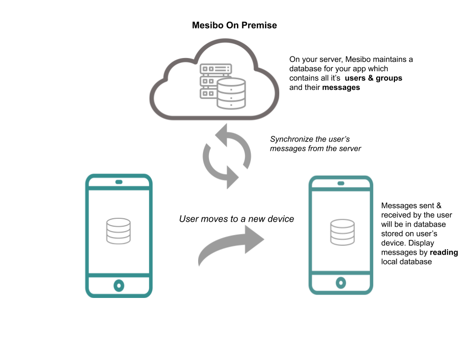



In this part, we will learn about synchronizing messages and user data on multiple devices with mesibo. 
> Note that the synchronization feature is exclusive to our [On-Premise]({{/on-premise}}) offering , where you can route all calls & messages through your own servers. 

## Prerequisites
You MUST go through the following prerequisites before you read further.

- Read the [First App]({{ '/documentation/tutorials/get-started/first-app/' | relative_url }}) Guide.
- Read one of the Android, iOS, JS, etc of this tutorial.
- Get familiar with [Read APIs]({{ '/documentation/tutorials/get-started/reading-messages' | relative_url }})
- Run [Mesibo On-Premise](https://mesibo.com/on-premise). See [On-Premise Docs]({{ '/documentation/on-premise' | relative_url }}) for installation instructions and more.

## Multi-Device Synchronization 
Mesibo stores your app data (messages & call logs, etc) on a local database on the user's device. To display messages to the user, you need to read messages(Using [Read APIs]({{ '/documentation/tutorials/get-started/reading-messages/#how-to-read-messages' | relative_url }})) from this local database. Now, if the user moves to a new device you will have a brand new database. Your user cannot view the old messages by reading the new database. The messages & other data present in the old database, stored on the old device is not available to the new device. But, if you are using [Mesibo On-Premise]({{ '/documentation/on-premise' | relative_url }}) you can always store messages and call data on your own server. So, whenever a user moves to a new device you can synchronize with your server and get the required messages. To perform this on-demand synchronization, mesibo provides [sync APIs](#using-the-sync-api). 


## Reading Messages 
When you use the `read` API you will be accessing the local database stored on the user's device. For example, in Android to read messages sent/received from a user with the address `"dest"` you call read as follows:
```java
Mesibo.ReadDbSession mReadSession = new Mesibo.ReadDbSession("dest", 0, null, this);
int count = mReadSession.read(100)
```
Once you call `read()`, it reads the local database and checks if there are messages for the user called `"dest"`. It will return the number of messages and you will be getting so many messages for that user through the listener `Mesibo_OnMessage`. See the section on [Read APIs]({{ '/documentation/tutorials/get-started/reading-messages' | relative_url }}) to know more.  

But when your user logs in on a new device, and you call `read()` for the first time, it will not give you any messages ie; The `count` returned will be `0`. This is because the new database will be initially empty and may not contain any messages for the user you have attempted to `read`. You need to sync the database on the new device to include messages for the selected user/group present on your server. One approach to do this will be, to transfer all of the data from your on-premise server's database to the app's local database. This is not recommended. You only need to `sync` messages for the selected user on demand and you can easily achieve this by using mesibo's `sync` API.

## Using the sync API
When your call to `read()` returns zero messages(which means there are no messages available in the local database for the user you are calling read), you may request for a `sync`. The `sync` method takes two parameters:
- **count** The number of messages you want to synchronize
- **OnSync** A callback function which will be called when sync completes. 

Note that a call to `read()` is synchronous while the call to `sync()` is asynchronous. The result of your `sync`
request will be avialble through the listener `on_sync`. The call to `sync` checks messages stored on the mesibo server and transfers those messages to your local database. The number of messages that have been synced will be available as a parameter `count` in the `on_sync` listener. You can read `count` number of messages using `read()`.

For example, 

In Android, 
```java
int c = mReadSession.read(100);
if(c == 0){
	// No messages available for this user in local database
	// Synchronize from server and check again
	// Sync for say 100 messages
	mReadSession.sync(100, this);
}

@Override
public void Mesibo_onSync(int i) {
	// i number of messages have been synced
	// You can now read i messages
	if(i <= 0) return;
	mReadSession.read(i);
}
```
In iOS,
```ios


```

In Javascript, after calling read you will get the messages when the callback `on_messages` is called. You can then call `getMessages()` to get your array of messages. If this array is empty, you can then call `sync`. When sync is complete, `on_sync` callback will be called where you can then call `read()`.  
```javascript
let rSession =  mesibo.readDbSession(peer, groupid, null,
	function on_messages(m) {
		let msgs = this.getMessages();
		if(!(msgs && msgs.length)){
			// Sync for say 100 messages
			this.sync(100,
				function on_sync(i){
					if(i>0){
						this.read(i);
					}
			});
		}
	});
rSession.read(100);
```

## How sync works
With [Mesibo On-Premise](https://mesibo.com/on-premise) running on your server, mesibo maintains a database for your app which contains all its users, groups, and messages. In your mesibo application,  you will load & display messages by reading from the local database stored on the user’s device. All the messages sent & received by the user to all other users and groups will be updated in the local database. 

So, when a user logs in with a new device, you have a new local database that you need to update with the messages stored on the server's database. That is, you synchronize the user’s local database from the server database. However, you need not pull all the data from the server's database. You only have a single app user on the device. Whenever your app user needs some data which is not already present on the local database, only then there is a need to sync from the server. 

For example, let's say you are logged in as `User-A` on your app and you need to display the chat history between you - `User-A` and another `User-B`. To do this you will use the `read` API to read messages for the `User-B`. If you are on a new device, and you have never exchanged messages with `User-B` on this device, the `read` API will not return any messages. You have nothing to display! But, if you had chatted with `User-B` earlier on a previous device, your messages will be stored on the server database. You need to access these messages present on the **server database** and restore them onto the **local database**. This is what the `sync` API does. Once the sync is complete, you can then `read` these old messages from the local database. 

Also note, that you may not be loading all the messages between `User-B` and `User-A` in one shot. You only need to load the last few messages(Say 10) that can be viewed first. Then, as the user scrolls the chat above you can load more messages. So, as the user scrolls you can read more messages & if there are no messages to read you cancall sync and check if there are any more messages available. Then call read again, when sync completes. You can call sync on demand and this read-sync cycle will continue. This way, you will provide a good user-experience and also ensure app performance.
 
